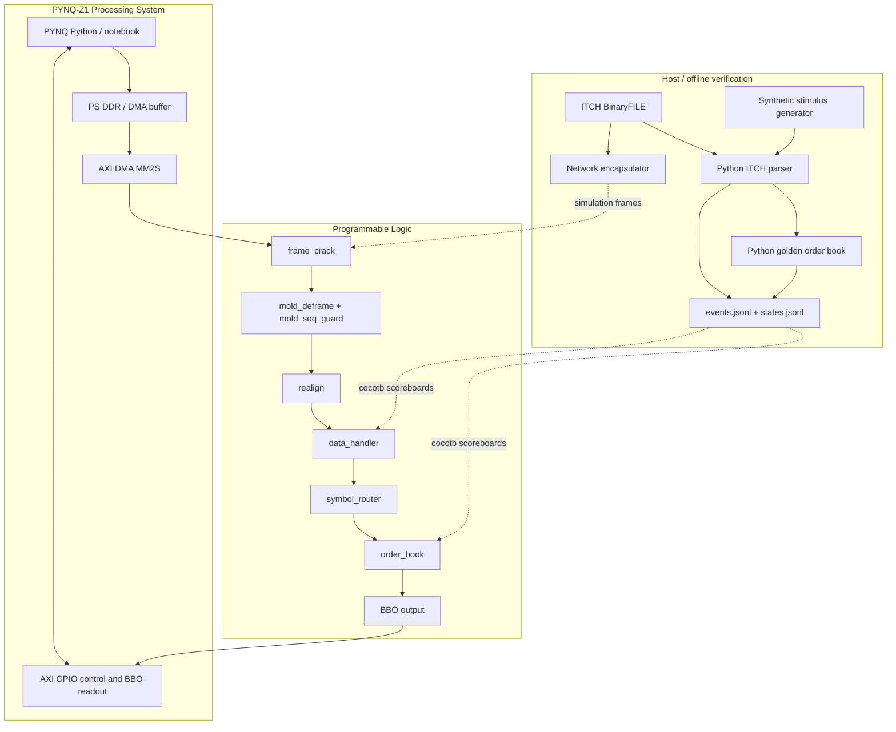
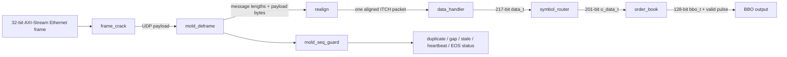
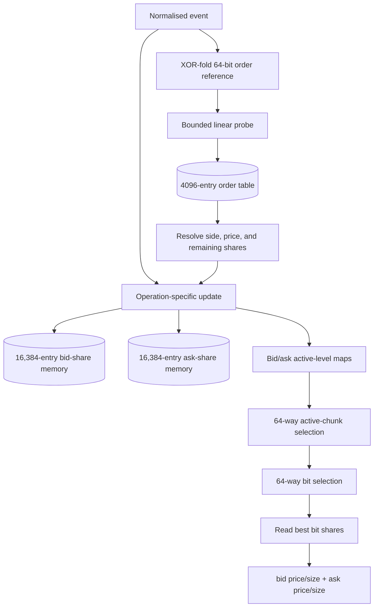
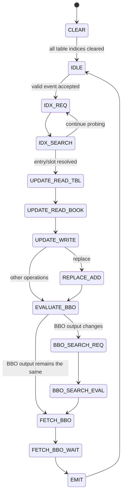
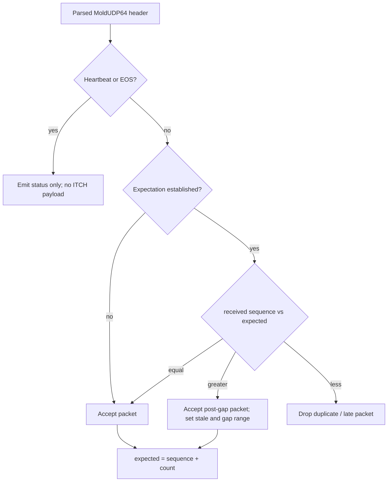
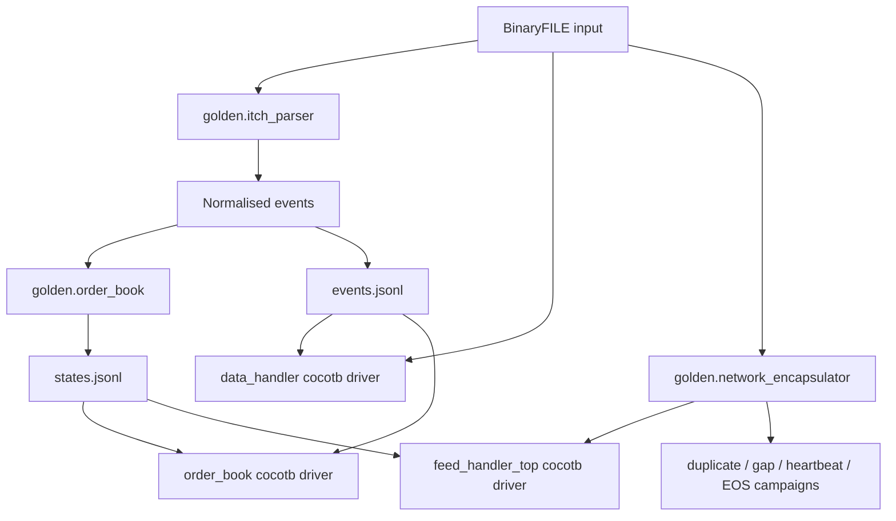
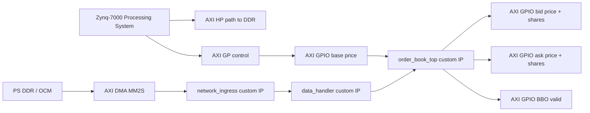

# ITCH 5.0 Feed Handler and FPGA Hardware Order Book

SystemVerilog RTL, Python reference models, and layered verification for a Nasdaq TotalView-ITCH 5.0-style feed handler and single-symbol hardware order book.

The project accepts Ethernet II / IPv4 / UDP / MoldUDP64-style frames, recovers variable-length ITCH messages, decodes displayed-book events, maintains price-level state, and emits best-bid/best-offer updates. It targets the **PYNQ-Z1 / Zynq-7020** for real-silicon bring-up through **Processing System to Programmable Logic AXI DMA**.

---

## Contents

- [Project status](#project-status)
- [System architecture](#system-architecture)
- [Protocol and book model](#protocol-and-book-model)
- [RTL datapath](#rtl-datapath)
- [Order-book architecture](#order-book-architecture)
- [MoldUDP64 sequence handling](#moldudp64-sequence-handling)
- [Interfaces and packed layouts](#interfaces-and-packed-layouts)
- [Golden model and verification](#golden-model-and-verification)
- [Quick start](#quick-start)
- [Generating network test vectors](#generating-network-test-vectors)
- [Vivado and PYNQ-Z1 build](#vivado-and-pynq-z1-build)
- [Measured implementation results](#measured-implementation-results)
- [Latency and throughput design decisions](#latency-and-throughput-design-decisions)
- [Known limitations](#known-limitations)
- [Roadmap](#roadmap)
- [Repository layout](#repository-layout)
- [Further documentation](#further-documentation)

---

## Project status

Status shown here reflects the current `main` branch as of **11 July 2026**.

| Area | Status | Evidence / qualification |
|---|---|---|
| Python ITCH parser | **Implemented and unit tested** | BinaryFILE parsing, stock-directory resolution, locate filtering, and `A/F/E/C/X/D/U` support |
| Python golden order book | **Implemented and unit tested** | Order lifecycle, price-level aggregation, BBO recomputation, replace edge cases, and invariants |
| Network encapsulator | **Implemented and unit tested** | BinaryFILE → MoldUDP64 → UDP → IPv4 → Ethernet II, with byte-exact round-trip checking |
| RTL ITCH decoder | **Implemented and golden-replay tested** | Complete synthetic BinaryFILE replay against `events.jsonl`; output backpressure checked |
| RTL order book | **Implemented and extensively BBO tested** | Directed lifecycle, aggregation, collision, replace, boundary, reset, and deterministic-random tests |
| Ingress chain | **Implemented and tested** | Ethernet/IPv4/UDP parsing, MoldUDP64 deframing, message realignment, malformed-frame handling |
| Full network-to-book path | **Implemented and golden-replay tested** | One and three ITCH messages per MoldUDP64 packet, compared against `states.jsonl` |
| Packet duplicate suppression | **Implemented and tested** | Exact duplicate and logical A/B-copy campaigns; first accepted copy updates the book |
| Gap/stale handling | **Implemented and tested** | Post-gap data is accepted, stale state is asserted, later missing packet is dropped |
| Heartbeat and EOS handling | **Implemented and tested** | Status-only; no order-book mutation |
| Vivado implementation | **Routed and bitstream generated** | PYNQ-Z1 / XC7Z020 build at 94.118 MHz |
| Board software replay | **Partially integrated / experimental** | Notebook exists; final automated hardware-vs-golden campaign remains outstanding |
| Full internal-state RTL scoreboard | **Not complete** | Current primary scoreboards compare decoded events and BBOs, not every internal table entry |
| Tick-to-trade egress | **Not implemented** | Planned extension |

### Verification gates

| Gate | Definition | Current status |
|---|---|---|
| G0 | Python parser, order-book oracle, synthetic stimulus, matched JSONL outputs | **Passed for current synthetic flow** |
| G1 | `data_handler.sv` matches `events.jsonl` | **Passed** |
| G2 | Direct order-book replay matches expected BBO after every event | **Passed for BBO; full internal-state comparison remains** |
| G3 | Ethernet → MoldUDP64 → decoder → book matches `states.jsonl` | **Passed for current synthetic campaigns** |
| G4 | Duplicate, logical A/B, gap, heartbeat, and EOS behaviour | **Passed for current packet-level campaigns** |
| G5 | Trigger → order-entry egress with measured tick-to-trade latency | **Not implemented** |
| G6 | Reproducible, automated real-board replay and final reporting | **Partial** |

---

## System architecture

### Host, Processing System, and Programmable Logic



### PL hot path



The design is deliberately layered. Each stage can be verified in isolation before the complete path is tested.

---

## PYNQ-Z1 hardware model

The PYNQ-Z1 Ethernet connector is attached to the Zynq **Processing System**, not directly to FPGA transceivers in the Programmable Logic. The implemented board path therefore uses:

```text
host file / generated frames
    -> ARM software
    -> PS DDR buffer
    -> AXI DMA MM2S
    -> PL AXI-Stream ingress
```

This exercises the same frame-facing RTL interface that a MAC or CMAC could drive on a networking FPGA, but it is **not direct physical-layer Ethernet ingress into the PL**.

The repository does not claim:

- direct live Nasdaq multicast access;
- SFP+/QSFP or GT transceiver integration;
- 10G, 25G, 40G, or 100G wire-rate operation;
- a production A/B dual-port network front end;
- a retransmission or GLIMPSE recovery channel;
- exchange order-entry certification.

---

## Protocol and book model

Nasdaq TotalView-ITCH describes the lifecycle of individual displayed orders. The feed handler reconstructs the book; it does not match orders.


### Relevant ITCH message types

| Type | Name | RTL / golden treatment |
|---|---|---|
| `R` | Stock Directory | Golden model resolves symbol → daily stock-locate code; not a book mutation |
| `A` | Add Order | Insert displayed order |
| `F` | Add Order with MPID | Insert displayed order; attribution is ignored for book state |
| `E` | Order Executed | Reduce shares using the referenced order’s stored side and price |
| `C` | Order Executed with Price | Reduce displayed shares; execution price is decoded but the displayed level is resolved from the order table |
| `X` | Order Cancel | Reduce displayed shares |
| `D` | Order Delete | Remove all remaining displayed shares |
| `U` | Order Replace | Remove old reference and insert new reference with inherited side |

Other source messages may still be carried through MoldUDP64 sequencing but are ignored by the displayed-book decoder.

### Data representation

- ITCH integers are parsed as **big-endian unsigned integers**.
- ITCH `Price(4)` values have four implied decimal places in the protocol.
- The RTL price and `base_price_i` ports are 32-bit integers and must use the **same unit**.
- The dense hardware level window contains `2^BBO_W = 16,384` indices.
- The current hardware computes `price_index = price - base_price` and keeps the low 12 bits.

> A final board campaign must freeze one price unit end-to-end and keep every accepted price inside the configured 16,384-index window. The current RTL does not yet reject below-base or above-window prices.

---

## RTL datapath

### `frame_crack.sv`

Parses a complete Ethernet II frame and emits the UDP payload as a MoldUDP64 datagram.

Current contract:

- 32-bit AXI-Stream;
- network-byte-order lanes;
- one complete Ethernet frame per AXI packet;
- untagged Ethernet II;
- IPv4 only;
- IPv4 IHL must be 5;
- UDP only;
- IPv4 fragments are dropped;
- optional destination-port checking through parameters;
- IP and UDP checksums are not validated;
- malformed `tkeep`, runt frames, invalid lengths, bad EtherType, IP version, IHL, protocol, fragmentation, or configured destination port produce error status.

The 42-byte Ethernet + IPv4 + UDP prefix is handled by a fixed 32-bit aligner. This avoids a generic byte-lane parser on the current narrow interface and reduces combinational work, at the cost of fixing the supported header shape.

### `mold_deframe.sv`

Parses:

```text
session[10] + first_sequence[8] + message_count[2]
    + message_count * (message_length[2] + ITCH_payload)
```

It emits:

- the concatenated ITCH payload byte stream;
- one length token per ITCH message;
- session, sequence, count, and expected-next metadata;
- drop/error status for malformed MoldUDP64 datagrams;
- sequence-guard status.

### `mold_seq_guard.sv`

Implements packet-level sequence acceptance:

- first packet: accepted and establishes `expected_seq_o`;
- `received_seq == expected_seq`: accepted and advances expectation;
- `received_seq > expected_seq`: accepted, reports a gap, and marks the stream stale;
- `received_seq < expected_seq`: dropped as duplicate/late;
- heartbeat (`count == 0`): status-only;
- EOS (`count == 0xffff`): status-only.

This keeps the hot path moving after a gap instead of stalling for recovery.

### `realign.sv`

MoldUDP64 messages are variable length and are not aligned to 32-bit words. `realign` consumes the payload stream plus message-length tokens and emits exactly one aligned AXI packet per ITCH message.

It handles:

- messages spanning multiple input beats;
- several message boundaries within one MoldUDP64 datagram;
- final partial beats;
- backpressure;
- zero length, underflow, overflow, and malformed-`tkeep` status.

### `data_handler.sv`

Decodes one aligned ITCH message into the internal `data_t` event structure.

Supported book-mutating types:

```text
A, F, E, C, X, D, U
```

Unsupported types are consumed without producing an event. The output remains valid and stable while the downstream book applies backpressure.

### `symbol_router.sv`

The current design maintains one hardware book. `symbol_router`:

- accepts only `stock_locate == 16'd1`;
- consumes and drops all other decoded locates without applying book backpressure;
- forwards `base_price_i` from the PS to the order book;
- removes the locate field before the single-book boundary.

The current notebook preprocesses a selected symbol and rewrites its daily stock-locate code to `1` before DMA transmission.

### `order_book.sv`

Maintains:

- a BRAM-inferred order-reference table;
- separate BRAM-inferred bid and ask aggregate-share arrays;
- hierarchical active-level maps;
- a serial multi-cycle update state machine;
- a 128-bit BBO output with a one-cycle valid pulse.

The book supports Add, Execute, Execute-with-Price, Cancel, Delete, and Replace operations.

---

## Order-book architecture



### Current book parameters

| Parameter | Current value | Meaning |
|---|---:|---|
| `ORN_W` | 64 | Order reference width |
| `PRICE_W` | 32 | Price integer width |
| `SHARES_W` | 32 | Per-order and per-level aggregate width |
| `HASH_W` | 14 | `16,384` order-table entries |
| `BBO_W` | 14 | `16,384` price indices per side |
| `CHUNK_W` | 6 | 64 chunks × 64 levels |
| `MAX_PROBES` | 16 | Maximum intended probe depth |

### Update flow



### Latency decision

The order book is deliberately **serial and non-overlapped**. A new event is accepted only when `ready_o` is asserted in `IDLE`.

This decision:

- guarantees message ordering;
- avoids overlapping read-modify-write hazards on the same reference or level;
- keeps functional verification straightforward;
- gives bounded, operation-dependent multi-cycle latency;
- does **not** provide an initiation interval of one event per cycle.

A pipelined version would need same-reference and same-level forwarding or stalls, equivalent to data-hazard handling in a processor pipeline.

---

## MoldUDP64 sequence handling



| Condition | Packet action | Status action |
|---|---|---|
| First data packet | Accept | Establish expected sequence |
| `seq == expected` | Accept | `in_order` pulse; advance by count |
| `seq > expected` | Accept | `gap` pulse; latch gap range; set sticky stale |
| `seq < expected` | Drop | `duplicate` pulse |
| `count == 0` | Drop payload | `heartbeat` pulse; may report a forward gap |
| `count == 0xffff` | Drop payload | `eos` pulse |

The current A/B verification is **logical packet duplication on one RTL input**, not arbitration between two independent physical receive interfaces.

---

## Interfaces and packed layouts

### AXI-Stream byte convention

```text
AXIS_DATA_W = 32
AXIS_KEEP_W = 4

lane 0 = tdata[31:24], qualified by tkeep[3]
lane 1 = tdata[23:16], qualified by tkeep[2]
lane 2 = tdata[15:8],  qualified by tkeep[1]
lane 3 = tdata[7:0],   qualified by tkeep[0]
```

Final-beat `tkeep` values are MSB-contiguous:

```text
1 valid byte  -> 1000
2 valid bytes -> 1100
3 valid bytes -> 1110
4 valid bytes -> 1111
```

A transfer occurs only when `tvalid && tready` is true.

### `data_t`: decoder → router

```text
217 bits, MSB -> LSB

message_type [216:209]   8 bits
stock_locate [208:193]  16 bits
orn          [192:129]  64 bits
updated_orn  [128:65]   64 bits
side         [64]        1 bit
shares       [63:32]    32 bits
price        [31:0]     32 bits
```

### `o_data_t`: router → book

```text
201 bits, MSB -> LSB

message_type [200:193]   8 bits
orn          [192:129]  64 bits
updated_orn  [128:65]   64 bits
side         [64]        1 bit
shares       [63:32]    32 bits
price        [31:0]     32 bits
```

### `bbo_t`: book output

```text
128 bits, MSB -> LSB

bid_price  [127:96]  32 bits
bid_shares [95:64]   32 bits
ask_price  [63:32]   32 bits
ask_shares [31:0]    32 bits
```

There are no explicit bid-valid or ask-valid bits. An empty side is currently encoded as zero price and zero shares.

### Top-level status

`feed_handler_top.sv` exposes:

- MoldUDP64 session, sequence, count, and expected-next metadata;
- in-order, duplicate, gap, heartbeat, and EOS pulses;
- sticky stale state;
- expected sequence and latched gap range;
- frame, MoldUDP64, and realignment errors;
- BBO data and BBO-valid pulse.

The current Vivado block design exports only the BBO, BBO-valid, and base-price controls through AXI GPIO. The wider sequence/error status has not yet been mapped into PS-visible control/status registers.

---

## Golden model and verification

The Python golden model is the functional source of truth.



### Matched oracle files

The default flow writes:

```text
build/golden/itch_synthetic.bin
build/golden/events.jsonl
build/golden/states.jsonl
```

- `itch_synthetic.bin` is a length-prefixed ITCH BinaryFILE stimulus.
- `events.jsonl` contains one normalised accepted book event per row.
- `states.jsonl` contains the expected state after the matching event.
- Row `n` in both JSONL files refers to the same source `msg_index`.

### Current cocotb layers

| Target | Test module | Main checks |
|---|---|---|
| `mold_seq_guard` | `test_mold_seq_guard.py` | first packet, in-order, gap, duplicate, heartbeat, EOS, stale behaviour |
| `data_handler` | `test_data_handler.py` | complete BinaryFILE replay against `events.jsonl`, ignored messages, output backpressure |
| `order_book` | `test_order_book.py` | directed lifecycle, aggregation, collisions, replace cases, boundaries, reset, random valid stream, oracle BBO replay |
| `order_book_top` | `test_order_book_top.py` | locate filtering, configurable base-price forwarding, wrapper replay |
| `ingress_top` | `test_ingress.py` | exact payload recovery, multi-message datagrams, stalls, heartbeat/EOS, bad-frame drop |
| `feed_handler_top` | `test_feed_handler_top.py` | G3 golden replay; G4 duplicates, logical A/B copies, gaps, late packets, heartbeat, EOS |

### Current full-chain campaigns

- one ITCH message per MoldUDP64 packet;
- three ITCH messages per MoldUDP64 packet;
- multiple message lengths and beat alignments;
- downstream backpressure;
- one repeated packet;
- one B-copy after every A-copy;
- a missing sequence followed by post-gap data and a late missing packet;
- heartbeat and EOS without book mutation;
- heartbeat-driven gap reporting;
- no unexpected frame, MoldUDP64, or realignment errors on valid streams.

### What is not yet proven

The main RTL scoreboards prove decoded events and BBO behaviour. They do not yet compare, after every event:

- every live order-table entry;
- every bid and ask aggregate level;
- per-level order counts, which are not currently stored in RTL;
- tombstone placement and table occupancy as an externally defined contract.

Full internal-state checking should initially use simulator backdoor access so it adds no hardware latency or area.

---

## Quick start

### Prerequisites

Recommended host setup:

- WSL Ubuntu 22.04 or a similar Linux environment;
- Python 3.13;
- `uv`;
- GNU Make;
- Verilator 5.x;
- cocotb 2.0.1;
- Vivado 2023.2 for xsim, synthesis, implementation, and board work.

Python 3.14 is not part of the currently tested cocotb setup.

### Clone and create the environment

```bash
git clone https://github.com/an-thony350/ITCH-Feed-Handler-and-Order-Book.git
cd ITCH-Feed-Handler-and-Order-Book

uv python install 3.13
uv venv --python 3.13 --seed .venv
source .venv/bin/activate

uv pip install -r requirements.txt
```

Check the tools:

```bash
python -VV
python -c "import cocotb; print(cocotb.__version__)"
verilator --version
```

Expected dependency versions include:

```text
cocotb 2.0.1
Verilator 5.x
```

### Run the complete host-side regression

From `tb/`:

```bash
cd tb
make
```

The default target:

1. runs `scripts/run_golden.sh`;
2. regenerates the synthetic BinaryFILE and JSONL oracles;
3. runs the sequence guard;
4. runs the decoder;
5. runs the order book;
6. runs the router/book wrapper;
7. runs ingress isolation;
8. runs the full feed-handler G3/G4 tests.

### Run one layer

```bash
cd tb

make test-mold-seq-guard
make test-data-handler
make test-order-book
make test-order-book-top
make test-ingress
make test-feed-handler-top
```

Equivalent direct form:

```bash
make SIM=verilator TOPLEVEL=feed_handler_top MODULE=test_feed_handler_top
```

### Clean simulator output

```bash
cd tb
make clean-all
rm -rf sim_build results.xml dump.vcd *.vcd *.fst
```

### Formatting

```bash
source .venv/bin/activate
uv pip install pre-commit
pre-commit install
./scripts/format.sh
```

Detailed environment instructions are in [`docs/environment.md`](docs/environment.md).

---

## Running the golden model

### Default synthetic oracle

```bash
scripts/run_golden.sh
```

### Deterministic synthetic run

```bash
scripts/run_golden.sh --seed 7 --random-message-count 100
```

### Real ITCH BinaryFILE by symbol

```bash
scripts/run_golden.sh \
    --input path/to/real_itch.bin \
    --symbol AAPL \
    --max-messages 100000 \
    --max-events 10000
```

### Real ITCH BinaryFILE by known locate

```bash
scripts/run_golden.sh \
    --input path/to/real_itch.bin \
    --locate 24 \
    --max-messages 100000 \
    --max-events 10000
```

Real multi-symbol input should be filtered by symbol or locate before it is treated as the oracle for the single-book RTL.

---

## Generating network test vectors

The public ITCH BinaryFILE format contains length-prefixed ITCH messages, not Ethernet/IP/UDP/MoldUDP64 frames. `golden/network_encapsulator.py` synthesises the network layers used by the RTL tests.

### Baseline encapsulation and round-trip check

```bash
python -m golden.network_encapsulator \
    build/golden/itch_synthetic.bin \
    --frames-out build/network/frames.bin \
    --meta-out build/network/frames.jsonl \
    --messages-per-packet 3 \
    --seq-start 1 \
    --session SESSION1 \
    --check-roundtrip
```

Outputs:

```text
build/network/frames.bin    raw concatenated Ethernet II frames
build/network/frames.jsonl  frame lengths, sequence/count metadata, message indices
```

### Duplicate one frame

```bash
python -m golden.network_encapsulator \
    build/golden/itch_synthetic.bin \
    --duplicate-frame 5
```

### Logical A/B duplicate stream

```bash
python -m golden.network_encapsulator \
    build/golden/itch_synthetic.bin \
    --ab-duplicate
```

### Drop a frame to create a sequence gap

```bash
python -m golden.network_encapsulator \
    build/golden/itch_synthetic.bin \
    --drop-frame 5
```

### Append heartbeat and EOS control packets

```bash
python -m golden.network_encapsulator \
    build/golden/itch_synthetic.bin \
    --emit-heartbeat \
    --emit-eos
```

`--check-roundtrip` is intentionally incompatible with destructive duplicate/drop campaigns.

---

## Directed SystemVerilog / xsim tests

The repository also contains directed SystemVerilog testbenches, including:

```text
tb/data_handler_tb.sv
tb/xsim/frame_crack_tb.sv
tb/xsim/mold_seq_guard_tb.sv
tb/xsim/mold_deframe_tb.sv
tb/xsim/realign_tb.sv
tb/xsim/ingress_top_tb.sv
tb/xsim/symbol_router_tb.sv
tb/xsim/order_book_tb.sv
tb/xsim/order_book_top_tb.sv
tb/xsim/feed_handler_top_tb.sv
```

These are intended for Vivado 2023.2 / xsim. The cocotb/Verilator flow is the primary automated golden-model scoreboard; it is not part of the FPGA implementation flow.

---

## Vivado and PYNQ-Z1 build

### Current block design



The current hardware build uses the modular Vivado IP chain rather than the simulation-only `feed_handler_top` wrapper.

### Address map

| Peripheral | Base address | Direction / use |
|---|---:|---|
| AXI DMA | `0x40400000` | PS control; MM2S frame input |
| Bid BBO GPIO | `0x41200000` | PL → PS, bid price and shares |
| Ask BBO GPIO | `0x41210000` | PL → PS, ask price and shares |
| BBO-valid GPIO | `0x41220000` | PL → PS, update indication |
| Base-price GPIO | `0x41230000` | PS → PL, price-window base |

The DMA instance is **MM2S-only**. There is no S2MM output stream in the current design.

### Board replay requirements

A correct board replay must:

1. load a matching `.bit` and `.hwh` pair;
2. program the base-price GPIO before sending events;
3. wait for the order book’s initial 4096-index clear to complete;
4. select one symbol and rewrite its daily locate to `1`, or change the router architecture;
5. keep the transmitted MoldUDP64 sequence contiguous across transmitted frames;
6. keep all prices inside the configured 4096-index hardware window;
7. capture every BBO update, including same-price size changes;
8. compare the captured board sequence automatically against the Python oracle.

The current notebook is a bring-up aid rather than the final automated board-validation harness.

---

## Measured implementation results

Latest exported routed build reviewed on **11 July 2026**:

| Item | Result |
|---|---|
| Vivado version | 2023.2 |
| Project | `Itch_Handler` |
| Top design | `design_1_wrapper` |
| Block design | `design_1` |
| Device | `xc7z020clg400-1` |
| Primary PL clock | `clk_fpga_0` |
| Clock period | 10.625 ns |
| Clock frequency | 94.118 MHz |
| Implementation | Routed |
| Bitstream | Generated |
| WNS | `+0.085 ns` |
| TNS | `0.000 ns` |

### Top-level utilisation

| Resource | Used | Available | Utilisation |
|---|---:|---:|---:|
| Slice LUTs | 37,186 | 53,200 | 69.90% |
| Slice registers | 13,954 | 106,400 | 13.11% |
| Block RAM tiles | 23 | 140 | 16.43% |
| DSPs | 0 | 220 | 0.00% |

The order-book hierarchy dominates custom logic use. The recorded worst setup path is primarily routing delay rather than logic depth: approximately **94% route delay** on the worst path at the exported build.

> The current source tree contains a later order-book fanout/timing-oriented RTL change. A new post-route report is required before claiming improved frequency or resources for that source revision.

---

## Latency and throughput design decisions

### Ingress

- The external simulation and DMA interface is 32 bits wide.
- The theoretical raw bus ceiling at 94.118 MHz is approximately 3.01 Gbit/s before protocol and control overhead.
- The current parser stages retain and process beats internally; no 10G or 25G line-rate claim is made.
- Fixed-offset parsing minimises generic byte-selection logic for the supported frame shape.
- Gap detection does not block the hot path.

### Decoder

- The decoder processes one aligned ITCH packet at a time.
- Backpressure holds the completed normalised event stable.
- Unsupported messages are skipped without producing book events.

### Order book

- Serial multi-cycle operation prioritises correctness and deterministic ordering over initiation interval.
- BRAM-style synchronous reads add explicit lookup/update states.
- Separate bid/ask memories prevent same-price side aliasing.
- Hierarchical 64 × 64 occupancy maps avoid a single flat 4096-bit priority encoder.
- BBO search is currently performed after every accepted event.

### Why these choices

On the Zynq-7020, the design is LUT-constrained rather than BRAM- or DSP-constrained. The current architecture therefore favours:

- bounded table and price-window sizes;
- serial state transitions instead of overlapping hazards;
- hierarchical BBO selection;
- explicit staging around inferred block memories;
- no speculative multi-event concurrency.

Future optimisation should first measure event latency and throughput, then target the actual critical path and common-case BBO updates.

---

## Known limitations

### Correctness and supported operating envelope

- **Price-window validation:** the book does not currently reject a price below `base_price_i` or more than 4095 indices above it; invalid deltas can wrap through 12-bit truncation.
- **Hash-probe exhaustion:** the table is intended to use at most 16 probes, but there is no final overflow/error exit. Workloads must remain within the supported collision/load envelope.
- **Duplicate add / missing reference policy:** invalid lifecycle events do not yet have a complete externally reported error contract.
- **Share arithmetic:** over-execute, over-cancel, and aggregate overflow behaviour is not hardened for malformed input.
- **Empty BBO side:** zero price and zero shares represent an empty side; no explicit valid bits exist.
- **Base-price reconfiguration:** changing the base while live orders remain is unsupported.
- **Full state:** RTL does not store per-level order counts, and the primary scoreboard does not prove every table/level entry after every event.

### Network and sequence handling

- only untagged Ethernet II is supported;
- no VLAN parsing;
- IPv4 options are not supported;
- fragmented IPv4 packets are dropped;
- IP and UDP checksums are not validated;
- Ethernet FCS is assumed to have been handled before the RTL boundary;
- A/B testing duplicates packets on one input rather than using two physical receivers;
- no retransmission request or state-recovery channel exists;
- a session identifier change does not yet trigger a defined book/session reset policy;
- 64-bit MoldUDP64 sequence wrap is out of scope;
- sticky stale clear exists inside the sequence guard but is not exposed in the current top-level integration.

### Hardware and software

- PYNQ-Z1 Ethernet enters through the PS, not directly into the PL;
- current DMA is MM2S-only;
- Verilator ingress/full-chain builds currently use `-Wno-fatal`; remaining width/lint warnings should be resolved before treating lint as a release gate;
- sequence/error status is not yet PS-visible through a complete CSR bank;
- one-cycle BBO-valid through GPIO is not an ideal lossless event transport;
- the current notebook is not yet an automated hardware-vs-golden regression;
- the measured build is 94.118 MHz, not the original 100 MHz target;
- no tick-to-trade trigger or order-entry egress is implemented.

---

## Roadmap

### Correctness hardening

- add explicit price-window validation and an error/status output;
- add a bounded hash-failure exit and counter;
- define duplicate/missing-reference/over-reduction policies;
- add bid-valid and ask-valid bits;
- prevent or explicitly sequence live base-price changes;
- expose stale clear and session reset controls.

### Verification closure

- compare every live order-table entry and every bid/ask level after each event;
- add per-level order counts or explicitly constrain the hardware contract to aggregate shares only;
- run a large filtered real-Nasdaq BinaryFILE campaign;
- run the same real-data slice through the complete network encapsulation path;
- add malformed-packet and random-backpressure coverage for every documented error bit;
- add CI for Python, Verilator, lint, and formatting.

### Hardware closure

- replace GPIO polling of BBO-valid with a sticky counter, interrupt, or FIFO;
- map sequence, gap, stale, and error counters into PS-visible CSRs;
- create a reproducible Vivado build Tcl flow;
- regenerate matching `.bit`, `.hwh`, and `.xsa` artifacts;
- automate board replay and golden comparison;
- rerun implementation after the latest timing optimisation.

### Performance

- measure cycles from event handshake to BBO-valid by operation type and collision depth;
- measure accepted frame beats per cycle, messages per second, and effective throughput;
- make BBO maintenance incremental and rescan only when the current best level empties;
- reduce high-fanout occupancy-map control paths;
- consider pipelined event updates only with explicit same-reference and same-level forwarding/stalls.

### Extension

- add a deliberately simple programmable trigger;
- encode a minimal order-entry message;
- use UDP loopback for a measured demonstration rather than claiming full SoupBinTCP/TCP;
- report tick-to-trade min/median/p99/max and throughput;
- optionally synthesise against a networking-class FPGA after the PYNQ-Z1 design is closed.

---

## Repository layout

```text
.
├── golden/
│   ├── contracts.py                 Python event/book-state contracts
│   ├── itch_parser.py               BinaryFILE record reader and ITCH parser
│   ├── order_book.py                Reference displayed order book
│   ├── runner.py                    Parser + book oracle generator
│   ├── stimulus.py                  Directed and deterministic-random stimulus
│   ├── network_encapsulator.py      MoldUDP64/UDP/IPv4/Ethernet test-vector generator
│   └── tests/                       Golden-model and encapsulator unit tests
│
├── rtl/
│   ├── hdl_header.sv                Shared widths, structs, AXIS types, error maps
│   ├── frame_crack.sv               Ethernet II / IPv4 / UDP parser
│   ├── mold_seq_guard.sv            Packet sequence, duplicate, and gap policy
│   ├── mold_deframe.sv              MoldUDP64 parser and message splitter
│   ├── realign.sv                   Variable-length ITCH message alignment
│   ├── ingress_top.sv               Ingress wrapper
│   ├── data_handler.sv              ITCH payload decoder
│   ├── symbol_router.sv             Locate-1 filter and base-price forwarding
│   ├── order_book.sv                Order table, price levels, and BBO engine
│   ├── order_book_top.sv            Router + book wrapper
│   ├── feed_handler_top.sv           Complete simulation/integration wrapper
│   └── axis_skid_buffer.sv          AXI-stream buffering utility
│
├── tb/
│   ├── Makefile                     Golden + cocotb regression entry point
│   ├── test_mold_seq_guard.py       Sequence-policy tests
│   ├── test_data_handler.py         G1 decoder replay
│   ├── test_order_book.py           Direct book tests and oracle replay
│   ├── test_order_book_top.py       Router/book wrapper tests
│   ├── test_ingress.py              Ingress-only recovery tests
│   ├── test_feed_handler_top.py     G3/G4 full-chain campaigns
│   ├── itch_harness/                Drivers, layouts, oracle loader, scoreboard
│   └── xsim/                        Directed Vivado SystemVerilog testbenches
│
├── docs/
│   ├── environment.md               Toolchain and environment setup
│   ├── golden_model.md              Golden-model architecture
│   ├── data_handler.md              Decoder design
│   ├── networking_ingress.md        Ingress design and policies
│   ├── order_book.md                Order-book implementation
│   └── verification.md              Layered verification plan
│
├── notebooks/
│   └── v1_notebook.ipynb            PYNQ-Z1 replay / bring-up notebook
│
├── scripts/
│   ├── run_golden.sh                Compile, test, generate stimulus and oracles
│   └── format.sh                    Repository formatting checks
│
├── requirements.txt                 Host verification dependencies
└── README.md
```

---

## Further documentation

- [`docs/environment.md`](docs/environment.md) — complete Python, cocotb, Verilator, and Vivado setup
- [`docs/golden_model.md`](docs/golden_model.md) — parser, order-book oracle, and JSONL contracts
- [`docs/data_handler.md`](docs/data_handler.md) — ITCH decoder details
- [`docs/networking_ingress.md`](docs/networking_ingress.md) — Ethernet/IP/UDP/MoldUDP64 ingress
- [`docs/order_book.md`](docs/order_book.md) — hardware book structure and state machine
- [`docs/verification.md`](docs/verification.md) — layered verification flow and gates

---

## Engineering summary

The project demonstrates the complete simulated data path from encapsulated market-data-style Ethernet frames to a hardware-maintained BBO, with a Python golden model used at the decoder, book, and full-chain boundaries. Its strongest completed elements are the layered verification methodology, variable-length message recovery, packet-level sequencing behaviour, and a routed PYNQ-Z1 implementation. The next work is correctness hardening, full-state proof, automated board validation, and measured latency/throughput optimisation.
