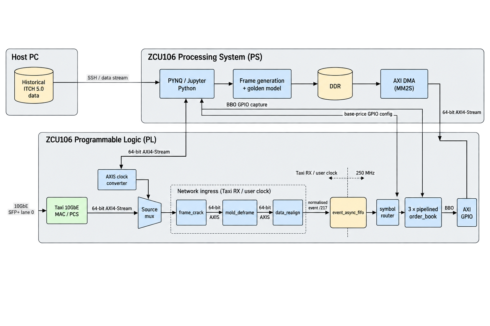
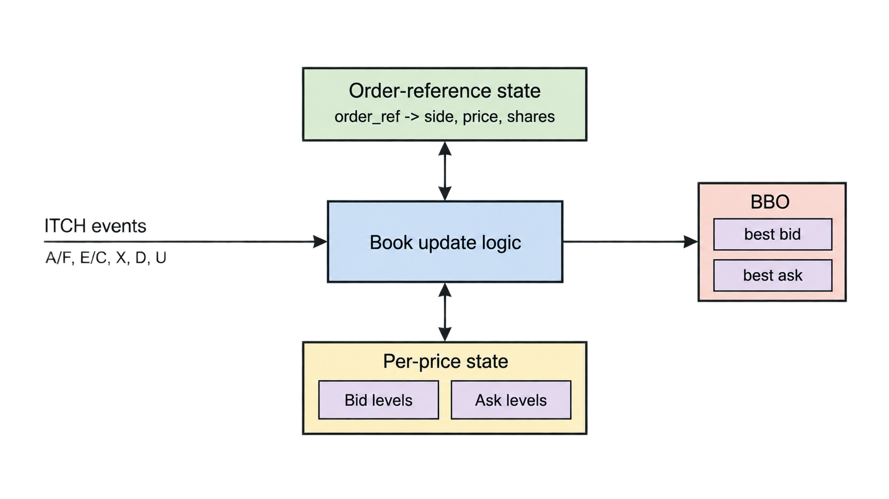
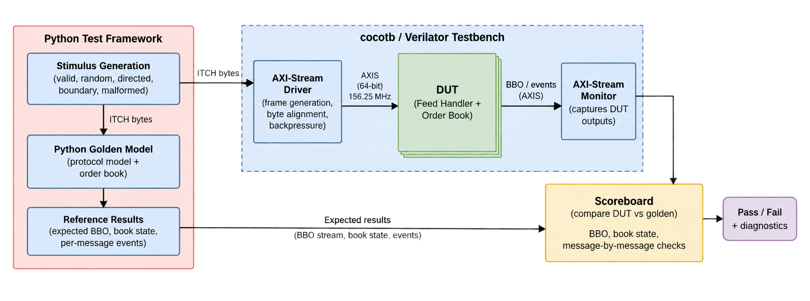
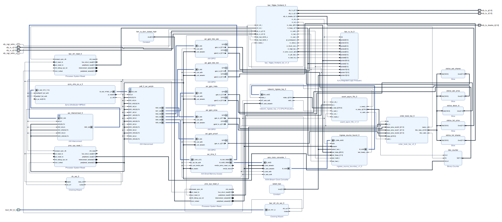
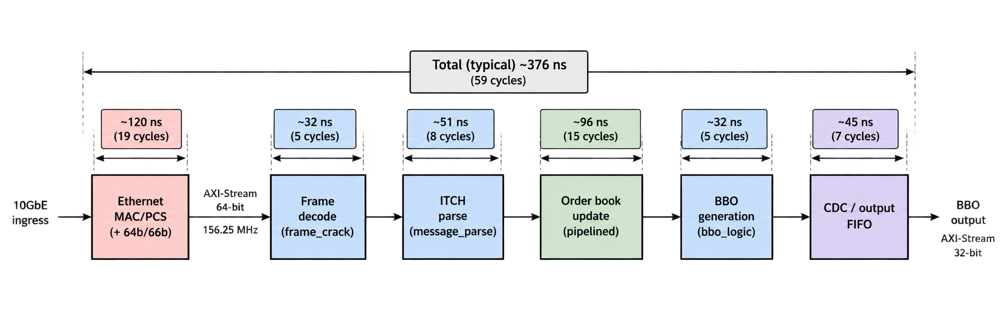

# ITCH 5.0 Feed Handler and FPGA Hardware Order Book

---

## Overview

We currently have a complete simulated native 64-bit path from market data wrapped in Ethernet frames to a hardware-maintained BBO:

<picture>
  <source media="(prefers-color-scheme: dark)" srcset="assets/host_ps_pl_architecture_dark.png">
  <source media="(prefers-color-scheme: light)" srcset="assets/host_ps_pl_architecture_light.png">
  
</picture>

The host-side PS in Python generates network frames and expected book states. Cocotb/Verilator tests network parsing, sequence handling, message decoding, order book, and the complete network-to-book path.

The current ZCU106 Vivado build also integrates a **Taxi-based 10GbE SFP+ frontend**, but we are not able to fully test it until we get a machine with 10Gbit SFP+ ports

For the latest design, we have the ingress running at Taxi's clock, and the Order book running at 250MHz

---

## ZCU106 hardware model

One of the benefits of the ZCU106 is that it provides SFP+ cages connected to UltraScale+ GTH transceivers in the Programmable Logic. The current design therefore supports a direct hardware Ethernet path into the PL rather than requiring packets to pass through the Processing System.

### Taxi 10GbE frontend

The Taxi integration uses the ZCU106's two SFP+ GTH lanes and a **64-bit Taxi MAC/PCS datapath**. The current ITCH path consumes lane 0 RX; the second physical lane remains present in the frontend but is not currently used for feed processing. We do need a little rewiring to match the required input into the network ingress

The frontend also exposes link/debug status including GT power-good, RX status, block lock, BER/error count and bad-FCS indications for physical bring-up. We currently have an ILA connected for future debug

---

## Protocol and book model

The order book allows us to take in ITCH messages and maintain price books and output BBO.

<picture>
  <source media="(prefers-color-scheme: dark)" srcset="assets/protocol_book_model_dark.png">
  <source media="(prefers-color-scheme: light)" srcset="assets/protocol_book_model_light.png">
  
</picture>

### Important ITCH message types

| Type | Name | Effect |
|---|---|---|
| `A` | Add Order | Insert displayed order |
| `F` | Add Order with MPID | Same as ADD, MPID we don't care about |
| `E` | Order Executed | Reduce shares using the referenced order's stored side and price |
| `C` | Order Executed with Price | Reduce displayed shares; the displayed level still comes from the order table |
| `X` | Order Cancel | Reduce displayed shares |
| `D` | Order Delete | Remove all remaining displayed shares |
| `U` | Order Replace | Remove the old reference and insert the replacement using the inherited side |

We still parse other ITCH messages through much of the ingress, but once we actually get to the decoder, we can throw them away

---

## Golden model and verification

We use a Python golden model as the source of truth. We take BinaryFILE records downloaded from the exchange website and turn them into normalised events, and run them through the reference order book. We output jsonl streams to compare to RTL results.

<picture>
  <source media="(prefers-color-scheme: dark)" srcset="assets/golden_model_top_dark.png">
  <source media="(prefers-color-scheme: light)" srcset="assets/golden_model_top_light.png">
  
</picture>

You can see more in [`docs/golden_model.md`](docs/golden_model.md).

---

## Vivado build

### Current block design

The DMA is MM2S-only, Taxi provides the real SFP+ Ethernet source. The DMA stream is clock-converted into the Taxi RX/user clock domain before the two sources meet at the static mux.

The 64-bit network ingress runs from the Taxi RX/user clock. Once a complete normalised event has been decoded, the asynchronous FIFO crosses the event into the 250 MHz order-book domain.

---

## Implementation Results

You can see the full reports in the `/implementation_reports` folder. Ran on Vivado 2023.2.

| Item | Result |
|---|---:|
| Target board | ZCU106 |
| SFP+ MGT reference clock | **156.25 MHz / 6.400 ns** |
| Routed Taxi RX/user clock | **~161.13 MHz / 6.206 ns** |
| Order Book clock | **250 MHz / 4.000 ns** |
| WNS | **+0.003   ns** |

All constraints are met and we don't have any hold problems.

### Utilisation

| Resource | Used | Available | Utilisation |
|---|---:|---:|---:|
| LUTs | 43,336 | 230,400 | 18.81% |
| LUTRAM / LUT memory | 1,911 | 101,760 | 1.88% |
| Flip-Flops | 49,874 | 460,800 | 10.82% |
| Block RAM | 51.5 | 312 | 16.51% |
| Ultra RAM | 24 | 96 | 25.00% |
| DSPs | 0 | 1728 | 0.00% |
| GTH channels | 2 | 20 | 10.00% |

---

## Latency and throughput

The ingress measurements below use the **156.25 MHz** simulation clock used for the native 64-bit line-rate regression. The latest routed Taxi RX/user clock is slightly different, as shown in the implementation table above. The data/order-book domain remains at **250 MHz**.

<picture>
  <source media="(prefers-color-scheme: dark)" srcset="assets/latency_dark.png">
  <source media="(prefers-color-scheme: light)" srcset="assets/latency_light.png">
  
</picture>

The current 64-bit ingress sustains approximately **9.83–9.91 Gbit/s**. This is obviously beloy 10Gbit, but actually is suitable once Ethernet framing overhead is accounted for. The Order Book has an II of 4 and runs at 250MHz so can take roughly 62.5M messages/s.

---

## Further documentation

- [`docs/environment.md`](docs/environment.md) — host toolchain and Vivado env setup
- [`docs/running_the_project.md`](docs/running_the_project.md) — golden-model, cocotb, vector-generation, xsim, formatting, and cleanup commands
- [`docs/golden_model.md`](docs/golden_model.md) — golden-model architecture and consolidated verification methodology
- [`docs/rtl_datapath.md`](docs/rtl_datapath.md) — data flow through rtl
- [`docs/networking_ingress.md`](docs/networking_ingress.md) — network ingress behaviour
- [`docs/moldudp64_seq_handling.md`](docs/moldudp64_seq_handling.md) — duplicate, gap, stale, heartbeat, and EOS policy
- [`docs/order_book.md`](docs/order_book.md) — v2 hardware order-book implementation
- [`docs/pipelined_order_book.md`](docs/pipelined_order_book.md) - v3+ varient of the order book specifically
- [`docs/proccessing_system.md`](docs/processing_system.md) - Processing system used to run the project

---

## Licensing

Project-specific software, documentation and independently authored components are provided under the repository's [MIT licence](LICENSE) unless otherwise stated.

We integrate the [Taxi transport library](https://github.com/fpganinja/taxi), whose core RTL is provided under the **CERN Open Hardware Licence Version 2 - Strongly Reciprocal (CERN-OHL-S-2.0)**

Taxi licensing info can be found in [`releases/v4.0/LICENSE.md`](releases/v4.0/LICENSE.md).

---

## Continuous integration

GitHub Actions runs repository checks, golden-model generation, and the full cocotb/Verilator RTL regression on pushes to main and pull requests. A separate performance workflow runs smoke tests for relevant changes and a scheduled full campaign, with oracle, diagnostic, and performance artifacts retained for inspection.
