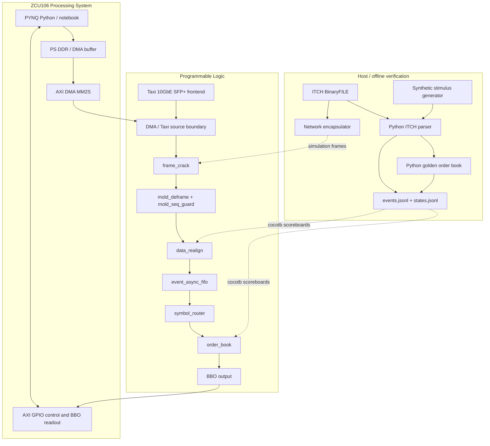
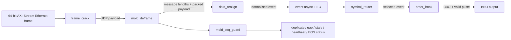
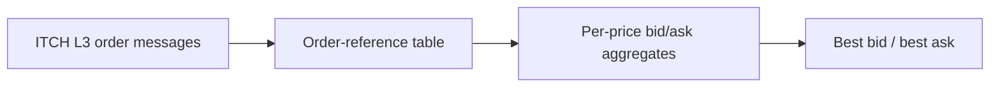
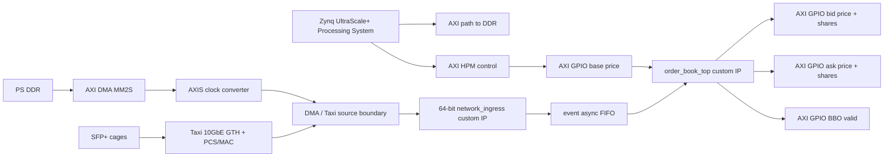

# ITCH 5.0 Feed Handler and FPGA Hardware Order Book


This project wraps historical Nasdaq TotalView-ITCH 5.0 data with Ethernet II, IPv4, UDP, and MOLDUDP64 headers. It then recovers variable-length ITCH messages, decodes book events, maintains price-level states, and emits best-bid/ask updates.

RTL is written in SystemVerilog, with Python-controlled PS and reference models for verification. Updates for the hardware system have been made to emulate a high-frequency-trading system.

---

## Contents

- [ITCH 5.0 Feed Handler and FPGA Hardware Order Book](#itch-50-feed-handler-and-fpga-hardware-order-book)
  - [Contents](#contents)
  - [Project status](#project-status)
  - [System architecture](#system-architecture)
    - [Host, Processing System, and Programmable Logic](#host-processing-system-and-programmable-logic)
    - [PL hot path](#pl-hot-path)
  - [ZCU106 hardware model](#zcu106-hardware-model)
    - [Taxi 10GbE frontend](#taxi-10gbe-frontend)
  - [Protocol and book model](#protocol-and-book-model)
    - [Relevant ITCH message types](#relevant-itch-message-types)
    - [Data representation](#data-representation)
  - [RTL datapath](#rtl-datapath)
  - [Golden model and verification](#golden-model-and-verification)
  - [Vivado and ZCU106 build](#vivado-and-zcu106-build)
    - [Current block design](#current-block-design)
    - [Address map](#address-map)
  - [Measured implementation results](#measured-implementation-results)
    - [Utilisation](#utilisation)
  - [Latency and throughput design decisions](#latency-and-throughput-design-decisions)
    - [Network ingress](#network-ingress)
    - [Decoder and order book](#decoder-and-order-book)
  - [Further documentation](#further-documentation)
  - [Continuous integration](#continuous-integration)

---

## Project status

As of **10th September 2026**, this project has a complete simulated native 64-bit path from market data wrapped in Ethernet frames to a hardware-maintained BBO:

```text
Ethernet II -> IPv4 -> UDP -> MoldUDP64
    -> ITCH decode -> symbol routing -> order book -> BBO
```

The host-side PS in Python generates network frames and expected book states. Cocotb/Verilator tests network parsing, sequence handling, message decoding, order book, and the complete network-to-book path. The ingress has now been migrated from a 32-bit to a **native 64-bit AXI4-Stream architecture**, with the network path designed around the 10GbE datapath width.

The current ZCU106 Vivado build also integrates a **Taxi-based 10GbE SFP+ frontend** while retaining the existing PS-to-PL DMA replay path. A static source mux immediately before `frame_crack` selects either DMA replay or Taxi Ethernet RX, allowing the deterministic board test path to remain available during physical 10GbE bring-up.

The latest routed design completes bitstream generation and meets timing. The order-book/data domain clocks at **250 MHz**, while the network ingress is clocked from Taxi's RX/user clock domain.

---

## System architecture

### Host, Processing System, and Programmable Logic


```mermaid
flowchart TB
    subgraph HOST[Host / offline verification]
        BIN[ITCH BinaryFILE]
        STIM[Synthetic stimulus generator]
        GP[Python ITCH parser]
        GB[Python golden order book]
        ENC[Network encapsulator]
        ORA[events.jsonl + states.jsonl]

        BIN --> GP
        STIM --> GP
        GP --> GB
        GP --> ORA
        GB --> ORA
        BIN --> ENC
    end

    subgraph PS[ZCU106 Processing System]
        PY[PYNQ Python / notebook]
        DDR[PS DDR / DMA buffer]
        DMA[AXI DMA MM2S]
        GPIO[AXI GPIO control and BBO readout]

        PY --> DDR --> DMA
        PY <--> GPIO
    end

    subgraph PL[Programmable Logic]
        TAXI[Taxi 10GbE SFP+ frontend]
        SRC[DMA / Taxi source boundary]
        FC[frame_crack]
        MD[mold_deframe + mold_seq_guard]
        DR[data_realign]
        CDC[event_async_fifo]
        SR[symbol_router]
        OB[order_book]
        BBO[BBO output]

        TAXI --> SRC
        SRC --> FC --> MD --> DR --> CDC --> SR --> OB --> BBO
    end

    ENC -. simulation frames .-> FC
    DMA --> SRC
    BBO --> GPIO
    ORA -. cocotb scoreboards .-> DR
    ORA -. cocotb scoreboards .-> OB
```

### PL hot path


```mermaid
flowchart LR
    A[64-bit AXI-Stream Ethernet frame] --> B[frame_crack]
    B -->|UDP payload| C[mold_deframe]
    C -->|message lengths + packed payload| D[data_realign]
    D -->|normalised event| E[event async FIFO]
    E --> F[symbol_router]
    F -->|selected event| G[order_book]
    G -->|BBO + valid pulse| H[BBO output]

    C --> I[mold_seq_guard]
    I --> J[duplicate / gap / stale / heartbeat / EOS status]
```

The network ingress remains in the fast network clock domain until a complete **217-bit normalised event** has been produced. The event FIFO then performs the CDC into the 250 MHz order-book/data domain. This avoids crossing the full raw Ethernet stream after parsing and keeps the CDC at a narrow semantic boundary.

---

## ZCU106 hardware model

The ZCU106 provides SFP+ cages connected to UltraScale+ GTH transceivers in the Programmable Logic. The current design therefore supports a direct hardware Ethernet path into the PL rather than requiring packets to pass through the Processing System.

The PS/DMA path is still retained for deterministic board replay:

```text
PS DDR -> AXI DMA -> AXIS clock conversion -> source mux -> network ingress
```

The direct Ethernet path is:

```text
SFP+ -> GTH -> Taxi PCS/MAC -> lane rewire -> source mux -> network ingress
```

Both sources therefore exercise the same `frame_crack`, MoldUDP64 and order-book datapath.

### Taxi 10GbE frontend

The Taxi integration uses the ZCU106's two SFP+ GTH lanes and a **64-bit Taxi MAC/PCS datapath**. The current ITCH path consumes lane 0 RX; the second physical lane remains present in the frontend but is not currently used for feed processing.

Taxi places the earliest Ethernet byte in the low byte lane, while the existing project convention places it in the most-significant byte lane. `lane_rewire` performs this byte-lane reversal before the static DMA/Taxi source mux. Both operations are combinational and add **zero pipeline cycles** to the ingress path.

The frontend also exposes link/debug status including GT power-good, RX status, block lock, BER/error count and bad-FCS indications for physical bring-up.

---

## Protocol and book model

Nasdaq TotalView-ITCH describes the lifecycle of individual displayed orders. The feed handler reconstructs the book; it does not match orders.


```mermaid
flowchart LR
    A[ITCH L3 order messages] --> B[Order-reference table]
    B --> C[Per-price bid/ask aggregates]
    C --> D[Best bid / best ask]
```

### Relevant ITCH message types

| Type | Name | RTL / golden treatment |
|---|---|---|
| `R` | Stock Directory | Golden model resolves symbol to the daily stock-locate code; not a book mutation |
| `A` | Add Order | Insert displayed order |
| `F` | Add Order with MPID | Insert displayed order; attribution is ignored for book state |
| `E` | Order Executed | Reduce shares using the referenced order's stored side and price |
| `C` | Order Executed with Price | Reduce displayed shares; the displayed level still comes from the order table |
| `X` | Order Cancel | Reduce displayed shares |
| `D` | Order Delete | Remove all remaining displayed shares |
| `U` | Order Replace | Remove the old reference and insert the replacement using the inherited side |

Other ITCH messages may still pass through MoldUDP64 sequencing, but messages that do not mutate the displayed book are ignored by the decoder.

### Data representation

- ITCH integers are parsed as **big-endian unsigned integers**.
- ITCH `Price(4)` values are modified in the PS to have a \$0.01 tick
(rather than the original $0.0001)
- The RTL price and configured base price use the same integer unit.
- The hardware price book is a bounded dense window indexed relative to the configured base price.
- Real multi-symbol data is filtered or routed before it enters an individual hardware book.

---

## RTL datapath

Detailed contracts, parsing assumptions, backpressure behaviour, and per-stage responsibilities are documented in [`docs/rtl_datapath.md`](docs/rtl_datapath.md).

| Stage | Responsibility |
|---|---|
| `frame_crack` | Validate the supported Ethernet/IPv4/UDP header shape and emit the UDP payload |
| `mold_deframe` | Parse MoldUDP64 metadata, remove two-byte message-length prefixes and emit packed ITCH payload bytes plus message-length tokens |
| `mold_seq_guard` | Accept in-order/post-gap packets, suppress duplicates, and report stale/gap state |
| `data_realign` | Track message boundaries directly in the packed 64-bit payload stream and decode `A/F/E/C/X/D/U` into the normalised event contract |
| `event_async_fifo` | Cross complete normalised events from the network clock domain into the 250 MHz data/order-book domain |
| `symbol_router` | Select the configured instrument/book and insert a register boundary |
| `order_book` | Resolve order references, update aggregate price levels, and emit BBO updates |

The previous separate `realign -> data_handler` path remains useful as a behavioural/reference implementation, but the current packaged Vivado ingress uses the merged `data_realign` path to avoid recreating a padded AXI packet for every ITCH message.

MoldUDP64 sequencing and recovery policy are documented separately in [`docs/moldudp64_sequence_handling.md`](docs/moldudp64_sequence_handling.md).

---

## Golden model and verification

The Python golden model is the functional source of truth. It converts BinaryFILE records into normalised events, replays those events through a reference order book, and writes matched `events.jsonl` and `states.jsonl` oracle streams for RTL comparison.

The golden-model architecture, verification layers, current coverage, and remaining proof gaps are consolidated in [`docs/golden_model.md`](docs/golden_model.md). Environment setup is in [`docs/environment.md`](docs/environment.md), and all commands for running the repository are in [`docs/running_the_project.md`](docs/running_the_project.md).

---

## Vivado and ZCU106 build

### Current block design


```mermaid
flowchart LR
    PS[Zynq UltraScale+ Processing System] --> HP[AXI path to DDR]
    PS --> GP[AXI HPM control]
    DDR[PS DDR] --> DMA[AXI DMA MM2S]
    DMA --> CC[AXIS clock converter]
    CC --> SRC[DMA / Taxi source boundary]

    SFP[SFP+ cages] --> TAXI[Taxi 10GbE GTH + PCS/MAC]
    TAXI --> SRC

    SRC --> NI[64-bit network_ingress custom IP]
    NI --> EF[event async FIFO]
    EF --> OBT[order_book_top custom IP]
    OBT --> BID[AXI GPIO bid price + shares]
    OBT --> ASK[AXI GPIO ask price + shares]
    OBT --> VAL[AXI GPIO BBO valid]
    GP --> BASE[AXI GPIO base price]
    BASE --> OBT
```

The hardware build remains modular. The DMA is **MM2S-only** and provides the deterministic replay source, while Taxi provides the real SFP+ Ethernet source. The DMA stream is clock-converted into the Taxi RX/user clock domain before the two sources meet at the static mux.

The 64-bit network ingress runs from the Taxi RX/user clock. Once a complete normalised event has been decoded, `event_async_fifo` crosses the event into the 250 MHz order-book domain.
### Address map

| Peripheral | Base address | Direction / use |
|---|---|---|
| AXI DMA | `0x80040000` | PS control; MM2S frame input |
| Bid BBO GPIO | `0x80030000` | PL to PS; bid price and shares |
| Ask BBO GPIO | `0x80020000` | PL to PS; ask price and shares |
| meta GPIO (valid bit) | `0x80010000` | PL to PS; update indication |
| Base-price GPIO | `0x80000000` | PS to PL; price-window base |
| Base-price 2 GPIO | `0x80050000` | PS to PL; price-window base |

> Note that multiple base price GPIOs are used for 2 stocks each

---

## Measured implementation results

Reports on these values can be found in [`implementation_reports`](implementation_reports).

Latest routed build captured on **10th September 2026**:

| Item | Result |
|---|---:|
| Vivado version | 2023.2 |
| Project | `Feed_Handler_v3.0` |
| Target board | ZCU106 |
| SFP+ MGT reference clock | **156.25 MHz / 6.400 ns** |
| Routed Taxi RX/user clock | **~161.13 MHz / 6.206 ns** |
| Order Book clock | **250 MHz / 4.000 ns** |
| WNS | **+0.006 ns** |
| TNS | **0.000 ns** |
| WHS | **+0.009 ns** |
| THS | **0.000 ns** |

All user-specified timing constraints are met and the implementation run completes through bitstream generation.

### Utilisation

| Resource | Used | Available | Utilisation |
|---|---:|---:|---:|
| LUTs | 37,679 | 230,400 | 16.35% |
| LUTRAM / LUT memory | 1,992 | 101,760 | 1.96% |
| Flip-Flops | 46,280 | 460,800 | 10.04% |
| Block RAM | 255.5 | 312 | 81.89% |
| Ultra RAM | 0 | 96 | 0.00% |
| DSPs | 0 | 1728 | 0.00% |
| GTH channels | 2 | 20 | 10.00% |

BRAM remains the main resource constraint. The Taxi integration increases LUT/register use and consumes two GTH channels, but does not materially change the fact that the order-book memories dominate BRAM utilisation.

---

## Latency and throughput design decisions

The ingress measurements below use the **156.25 MHz** simulation clock used for the native 64-bit line-rate regression. The latest routed Taxi RX/user clock is slightly different, as shown in the implementation table above. The data/order-book domain remains at **250 MHz**.

### Network ingress

| Stage | First output / completion | Sustained behaviour | Current limiter |
|---|---|---|---|
| `frame_crack` | UDP/MoldUDP64 forwarding begins after the fixed **42-byte** Ethernet/IPv4/UDP prefix; with 64-bit beats the first payload bytes occur in beat 5 | Up to one **64-bit beat per cycle** after payload streaming begins | Fixed header arrival and the 42-byte-to-8-byte alignment |
| `mold_deframe` + sequence guard | The 20-byte MoldUDP64 header is decoded across three 64-bit beats before body processing | Parallel body parser handles up to **8 raw bytes/cycle** with registered descriptor/compaction stages | Message-boundary classification and compaction, rather than the old byte-serial parser |
| `data_realign` | **9 cycles / 57.6 ns** from the final Ethernet beat to the normalised event in the cold-latency sweep | Accepts a complete packed 64-bit payload beat per cycle in the common case and decodes directly to `data_t` | Event-output capacity/backpressure rather than a separate per-message realignment stage |
| Complete ingress + decode | **19 cycles / 121.6 ns** for `D/X`, **20 / 128.0 ns** for `E`, and **21 / 134.4 ns** for `U/A/C/F` from first Ethernet beat to event | Measured **9.830-9.911 Gbit/s** across the supported message campaigns; all campaigns pass the calculated physical 10GbE wire-rate gate | A small number of zero-gap AXI stress stalls remain around the `frame_crack -> mold_deframe` boundary, but they do not prevent physical 10GbE-rate operation |

The final native-64-bit line-rate campaign measured:

```text
D:     9.911 Gbit/s
X:     9.906 Gbit/s
E:     9.866 Gbit/s
U:     9.870 Gbit/s
A:     9.902 Gbit/s
C:     9.902 Gbit/s
F:     9.911 Gbit/s
Mixed: 9.830 Gbit/s
```

These figures are measured on the AXI frame path while the pass/fail gate accounts for Ethernet preamble/SFD, FCS and inter-frame gap. This is why the required MAC-side rate is slightly below a literal 10.000 Gbit/s for normal Ethernet traffic.

### Decoder and order book

| Stage | Latency | Initiation behaviour | Reason for the decision |
|---|---|---|---|
| `data_realign` | Included in the **19-21 cycle** ingress/decode figures above | Direct packed-stream decode avoids the old `realign -> data_handler` per-message bubble | Merging realignment and decode removes duplicated byte movement and improves sustained ingress throughput |
| `event_async_fifo` | CDC/buffering latency only; no protocol processing | Decouples the fast network domain from the 100 MHz order-book domain | Crossing complete 217-bit events is simpler and lower bandwidth than crossing raw Ethernet data |
| `symbol_router` | **1 cycle / 4 ns** | Up to one accepted event per cycle when the selected book is ready | The register boundary isolates decoder timing from the book and provides clean routing control |
| `order_book` | **16-stage pipeline / 64 ns** at 250 MHz | Pipeline latency is separate from initiation rate; successive events can occupy different stages concurrently | Pipelining removes the old state-machine throughput limit while retaining the BRAM-based order and price books |


---

## Further documentation

- [`docs/environment.md`](docs/environment.md) — host toolchain and Vivado environment setup
- [`docs/running_the_project.md`](docs/running_the_project.md) — golden-model, cocotb, vector-generation, xsim, formatting, and cleanup commands
- [`docs/golden_model.md`](docs/golden_model.md) — golden-model architecture and consolidated verification methodology
- [`docs/rtl_datapath.md`](docs/rtl_datapath.md) — RTL stage contracts, handshakes, and design boundaries
- [`docs/networking_ingress.md`](docs/networking_ingress.md) — detailed Ethernet/IPv4/UDP/MoldUDP64 ingress behaviour
- [`docs/moldudp64_sequence_handling.md`](docs/moldudp64_sequence_handling.md) — duplicate, gap, stale, heartbeat, and EOS policy
- [`docs/data_handler.md`](docs/data_handler.md) — ITCH decoder details
- [`docs/order_book.md`](docs/order_book.md) — v2 hardware order-book implementation
- [`docs/pipelined_order_book.md`](docs/pipelined_order_book.md) - v3 varient of the order book specifically
- [`docs/proccessing_system.md`](docs/processing_system.md) - Processing system used to run the project

---

## Continuous integration

GitHub Actions runs repository checks, deterministic golden-model generation, and the full cocotb/Verilator RTL regression on pushes to `main` and pull requests. A separate performance workflow runs smoke tests for relevant changes and a scheduled full campaign, with oracle, diagnostic, and performance artifacts retained for inspection.
