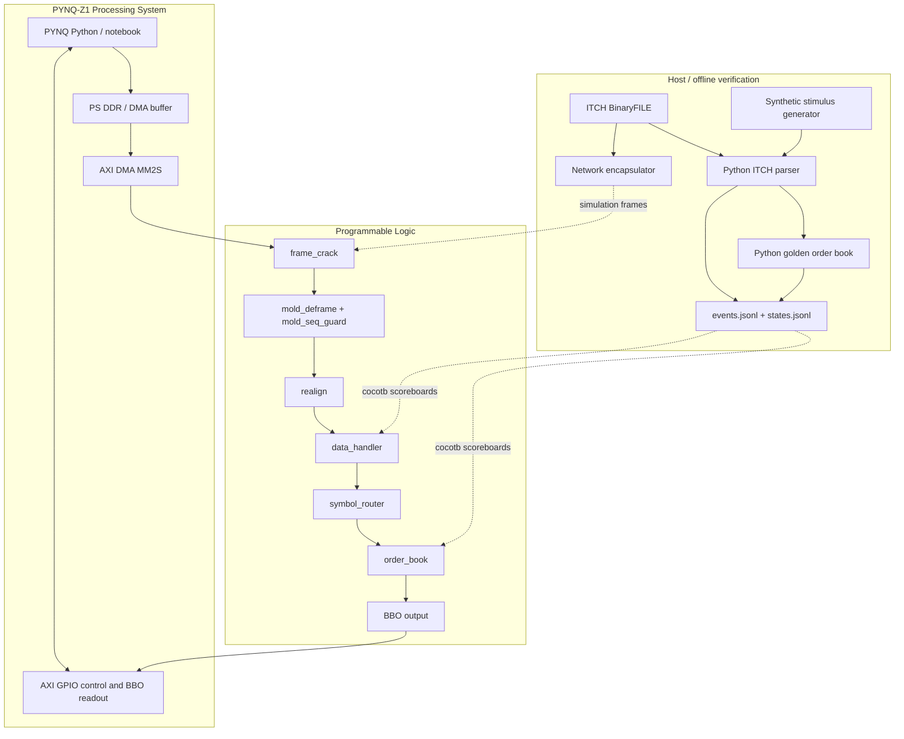
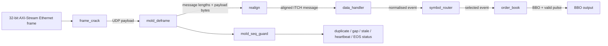
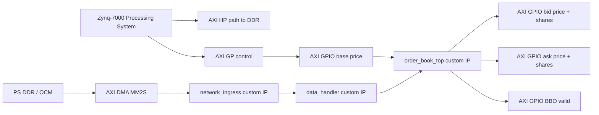

# ITCH 5.0 Feed Handler and FPGA Hardware Order Book


This project wraps historical Nasdaq TotalView-ITCH 5.0 data with Ethernet II, IPv4, UDP, and MOLDUDP64 headers. It then recovers variable-length ITCH messages, decodes book events, maintains price-level states, and emits best-bid/ask updates.

RTL is written in SystemVerilog, with Python-controlled PS and reference models for verification. Updates for the hardware system have been made to emulate a high-frequency-trading system.

---

## Contents

- [ITCH 5.0 Feed Handler and FPGA Hardware Order Book](#itch-50-feed-handler-and-fpga-hardware-order-book)
  - [Contents](#contents)
  - [Project status](#project-status)
- [System architecture](#system-architecture)
  - [Host, Processing System, and Programmable Logic](#host-processing-system-and-programmable-logic)
  - [PL hot path](#pl-hot-path)
- [ZCU106 hardware model](#zcu106-hardware-model)
- [Protocol and book model](#protocol-and-book-model)
  - [Relevant ITCH message types](#relevant-itch-message-types)
  - [Data representation](#data-representation)
- [RTL datapath](#rtl-datapath)
- [Golden model and verification](#golden-model-and-verification)
- [Vivado and ZCU106 build](#vivado-and-zcu106-build)
  - [Current block design](#current-block-design)
  - [Address map](#address-map)
- [Measured implementation results](#measured-implementation-results)
  - [Utilisation](#utilisation)
- [Latency and throughput design decisions](#latency-and-throughput-design-decisions)
  - [Network ingress](#network-ingress)
  - [Decoder and order book](#decoder-and-order-book)
- [Further documentation](#further-documentation)
- [Continuous integration](#continuous-integration)

---

## Project status

As of **1st September 2026**, this project has a complete simulated path from market data wrapped in ethernet frames to a hardware-maintained BBO:

```text
Ethernet II -> IPv4 -> UDP -> MoldUDP64 -> ITCH realignment
    -> ITCH decode -> symbol routing -> order book -> BBO
```

The host-side PS in Python generates network frames and expected book states. Cocotb/Verilator tests network parsing, sequence handling, message decoding, order book, and the complete network-to-book path. The latest ZCU106 is implemented at **100 MHz** in the datapath domain, and **156.25 MHz** in the networking domain.

> Note that the current hardware demonstration uses PS-to-PL DMA replay, rather than direct Ethernet into the FPGA fabric.
---

## System architecture

### Host, Processing System, and Programmable Logic


```mermaid
flowchart TB
    subgraph HOST[Host / offline verification]
        BIN[ITCH BinaryFILE]
        STIM[Synthetic stimulus generator]
        GP[Python ITCH parser]
        GB[Python golden order book]
        ENC[Network encapsulator]
        ORA[events.jsonl + states.jsonl]

        BIN --> GP
        STIM --> GP
        GP --> GB
        GP --> ORA
        GB --> ORA
        BIN --> ENC
    end

    subgraph PS[PYNQ-Z1 Processing System]
        PY[PYNQ Python / notebook]
        DDR[PS DDR / DMA buffer]
        DMA[AXI DMA MM2S]
        GPIO[AXI GPIO control and BBO readout]

        PY --> DDR --> DMA
        PY <--> GPIO
    end

    subgraph PL[Programmable Logic]
        FC[frame_crack]
        MD[mold_deframe + mold_seq_guard]
        RA[realign]
        DH[data_handler]
        SR[symbol_router]
        OB[order_book]
        BBO[BBO output]

        FC --> MD --> RA --> DH --> SR --> OB --> BBO
    end

    ENC -. simulation frames .-> FC
    DMA --> FC
    BBO --> GPIO
    ORA -. cocotb scoreboards .-> DH
    ORA -. cocotb scoreboards .-> OB
```

### PL hot path


```mermaid
flowchart LR
    A[32-bit AXI-Stream Ethernet frame] --> B[frame_crack]
    B -->|UDP payload| C[mold_deframe]
    C -->|message lengths + payload bytes| D[realign]
    D -->|aligned ITCH message| E[data_handler]
    E -->|normalised event| F[symbol_router]
    F -->|selected event| G[order_book]
    G -->|BBO + valid pulse| H[BBO output]

    C --> I[mold_seq_guard]
    I --> J[duplicate / gap / stale / heartbeat / EOS status]
```

The stages are separated so they can be tested independently before being integrated into the complete path.

---

## ZCU106 hardware model

The ZCU106 Ethernet connector is attached to the Zynq Processing System, not directly to the Programmable Logic. The current board path therefore replays generated frames from PS DDR through an MM2S AXI DMA into the same AXI-Stream ingress interface used in simulation.

A future direct-wire version requires a networking FPGA board whose Ethernet MAC, PHY, or SFP/QSFP transceiver path is accessible from the PL fabric. On that platform, the DMA source can be replaced by a MAC/CMAC stream while retaining the downstream protocol and book pipeline.

---

## Protocol and book model

Nasdaq TotalView-ITCH describes the lifecycle of individual displayed orders. The feed handler reconstructs the book; it does not match orders.


```mermaid
flowchart LR
    A[ITCH L3 order messages] --> B[Order-reference table]
    B --> C[Per-price bid/ask aggregates]
    C --> D[Best bid / best ask]
```

### Relevant ITCH message types

| Type | Name | RTL / golden treatment |
|---|---|---|
| `R` | Stock Directory | Golden model resolves symbol to the daily stock-locate code; not a book mutation |
| `A` | Add Order | Insert displayed order |
| `F` | Add Order with MPID | Insert displayed order; attribution is ignored for book state |
| `E` | Order Executed | Reduce shares using the referenced order's stored side and price |
| `C` | Order Executed with Price | Reduce displayed shares; the displayed level still comes from the order table |
| `X` | Order Cancel | Reduce displayed shares |
| `D` | Order Delete | Remove all remaining displayed shares |
| `U` | Order Replace | Remove the old reference and insert the replacement using the inherited side |

Other ITCH messages may still pass through MoldUDP64 sequencing, but messages that do not mutate the displayed book are ignored by the decoder.

### Data representation

- ITCH integers are parsed as **big-endian unsigned integers**.
- ITCH `Price(4)` values are modified in the PS to have a \$0.01 tick
(rather than the original $0.0001)
- The RTL price and configured base price use the same integer unit.
- The hardware price book is a bounded dense window indexed relative to the configured base price.
- Real multi-symbol data is filtered or routed before it enters an individual hardware book.

---

## RTL datapath

Detailed contracts, parsing assumptions, backpressure behaviour, and per-stage responsibilities are documented in [`docs/rtl_datapath.md`](docs/rtl_datapath.md).

| Stage | Responsibility |
|---|---|
| `frame_crack` | Validate the supported Ethernet/IPv4/UDP header shape and emit the UDP payload |
| `mold_deframe` | Parse MoldUDP64 metadata and split length-prefixed ITCH message blocks |
| `mold_seq_guard` | Accept in-order/post-gap packets, suppress duplicates, and report stale/gap state |
| `realign` | Convert unaligned payload bytes into one aligned AXI packet per ITCH message |
| `data_handler` | Decode `A/F/E/C/X/D/U` messages into the internal event contract |
| `symbol_router` | Select the configured instrument/book and insert a register boundary |
| `order_book` | Resolve order references, update aggregate price levels, and emit BBO updates |

MoldUDP64 sequencing and recovery policy are documented separately in [`docs/moldudp64_sequence_handling.md`](docs/moldudp64_sequence_handling.md).

---

## Golden model and verification

The Python golden model is the functional source of truth. It converts BinaryFILE records into normalised events, replays those events through a reference order book, and writes matched `events.jsonl` and `states.jsonl` oracle streams for RTL comparison.

The golden-model architecture, verification layers, current coverage, and remaining proof gaps are consolidated in [`docs/golden_model.md`](docs/golden_model.md). Environment setup is in [`docs/environment.md`](docs/environment.md), and all commands for running the repository are in [`docs/running_the_project.md`](docs/running_the_project.md).

---

## Vivado and ZCU106 build

### Current block design


```mermaid
flowchart LR
    PS7[Zynq-7000 Processing System] --> HP[AXI HP path to DDR]
    PS7 --> GP[AXI GP control]
    DDR[PS DDR / OCM] --> DMA[AXI DMA MM2S]
    DMA --> NI[network_ingress custom IP]
    NI --> DH[data_handler custom IP]
    DH --> OBT[order_book_top custom IP]
    OBT --> BID[AXI GPIO bid price + shares]
    OBT --> ASK[AXI GPIO ask price + shares]
    OBT --> VAL[AXI GPIO BBO valid]
    GP --> BASE[AXI GPIO base price]
    BASE --> OBT
```

The hardware build uses modular Vivado IP blocks. The DMA is **MM2S-only**: frames move from PS memory into the PL, while BBO values and configuration are exposed through AXI GPIO.

### Address map

| Peripheral | Base address | Direction / use |
|---|---|---|
| AXI DMA | `0x80400000` | PS control; MM2S frame input |
| Bid BBO GPIO | `0x80030000` | PL to PS; bid price and shares |
| Ask BBO GPIO | `0x80020000` | PL to PS; ask price and shares |
| meta GPIO (valid bit) | `0x80010000` | PL to PS; update indication |
| Base-price GPIO | `0x80000000` | PS to PL; price-window base |
| Base-price 2 GPIO | `0x80050000` | PS to PL; price-window base |

> Note that multiple base price GPIOs are used for 2 stocks each

---

## Measured implementation results

Reports on these values can be found in [`implementation_reports`](implementation_reports)

Latest routed build captured on **1st September 2026**:

| Item | Result |
|---|---:|
| Vivado version | 2023.2 |
| Project | `Feed_Handler_v3.0` |
| Target board | ZCU106 |
| Clock period (Networking) | **6.400 ns** |
| Clock frequency (Netowrking) | **156.25 MHz** |
| Clock period (Data Handling) | **10.000 ns** |
| Clock frequency (Data Handling) | **100 MHz** |
| WNS | **+0.089 ns** |
| TNS | **0.000 ns** |

### Utilisation

| Resource | Used | Available | Utilisation |
|---|---:|---:|---:|
| LUTs | 30,312 | 230,400 | 13.16% |
| LUTRAM | 1,575 | 101,760 | 1.55% |
| Flip-Flops | 40,477 | 460,800 | 8.78% |
| Block RAM | 250 | 312 | 80.13% |
| Ultra RAM | 0 | 96 | 0.00% |
| DSPs | 0 | 1728 | 0.00% |

Currently, the BRAM is the limiting resource (not allowing us to track more than 1 stock at a time). However, future varients are planning to use URAM to split the memory access.

---

## Latency and throughput design decisions

The cycle counts below assume no downstream backpressure and use the routed **100 MHz** clock for the data domain, and **156.25 MHz** for the networking domain. Nanosecond figures are rounded from the 10/6.4 ns period.

### Network ingress

| Stage | First output / completion | Sustained behaviour | Current limiter |
|---|---|---|---|
| `frame_crack` | **11 cycles / 70.4 ns** to the first MoldUDP64 beat | Up to one 32-bit beat per cycle after the fixed header | The 42-byte Ethernet/IPv4/UDP prefix must arrive before payload forwarding |
| `mold_deframe` + sequence guard | **24 cycles / 153.6 ns** to sequence status; about **33 cycles / 211.2 ns** to the first ITCH-payload beat | About four payload bytes per six cycles at **10 Gbit/s** | A stored 32-bit beat is consumed one byte per cycle, with output and length-token handshakes |
| `realign` | About **4 cycles / 25.6 ns** to the first aligned ITCH beat | About four payload bytes per six cycles at **10 Gbit/s** | The stage repeats byte-serial unpacking and repacking and cannot accept a new beat while holding one |
| Complete ingress | About **50 cycles / 320.0 ns** from the first Ethernet beat to the first aligned ITCH beat | Raw recovered-ITCH ceiling of **10 Gbit/s** | Duplicated byte-serial work in `mold_deframe` and `realign` |

### Decoder and order book

| Stage | Latency | Initiation behaviour | Reason for the decision |
|---|---|---|---|
| `data_handler` | About **4-8 cycles / 40-80 ns**, depending on ITCH message length | First-beat interval of roughly **6-11 cycles** | One message is accumulated and then held in `SEND` until the event is accepted |
| `symbol_router` | **1 cycle / 10 ns** | Up to one accepted event per cycle when the selected book is ready | The register boundary isolates decoder timing from the book and provides clean routing control |
| `order_book` |  **10 cycles / 100 ns**, or **10 million events/s**. | Initiation of this block requires 16,384 clock cycles to reset order and price books |

Although at 100 MHz the end-to-end latency of the decoder and order book is slightly higher. This table doesnt account for the pipelining impact caused by the system. However for multiple entries (assuming we have the optimal messages of v2), there is a clear latency winner in this system. This is proved in the [pipelined_order_book](/docs/pipelined_order_book.md) markdown file.


---

## Further documentation

- [`docs/environment.md`](docs/environment.md) — host toolchain and Vivado environment setup
- [`docs/running_the_project.md`](docs/running_the_project.md) — golden-model, cocotb, vector-generation, xsim, formatting, and cleanup commands
- [`docs/golden_model.md`](docs/golden_model.md) — golden-model architecture and consolidated verification methodology
- [`docs/rtl_datapath.md`](docs/rtl_datapath.md) — RTL stage contracts, handshakes, and design boundaries
- [`docs/networking_ingress.md`](docs/networking_ingress.md) — detailed Ethernet/IPv4/UDP/MoldUDP64 ingress behaviour
- [`docs/moldudp64_sequence_handling.md`](docs/moldudp64_sequence_handling.md) — duplicate, gap, stale, heartbeat, and EOS policy
- [`docs/data_handler.md`](docs/data_handler.md) — ITCH decoder details
- [`docs/order_book.md`](docs/order_book.md) — v2 hardware order-book implementation
- [`docs/pipelined_order_book.md`](docs/pipelined_order_book.md) - v3 varient of the order book specifically
- [`docs/proccessing_system.md`](docs/processing_system.md) - Processing system used to run the project

---

## Continuous integration

GitHub Actions runs repository checks, deterministic golden-model generation, and the full cocotb/Verilator RTL regression on pushes to `main` and pull requests. A separate performance workflow runs smoke tests for relevant changes and a scheduled full campaign, with oracle, diagnostic, and performance artifacts retained for inspection.
