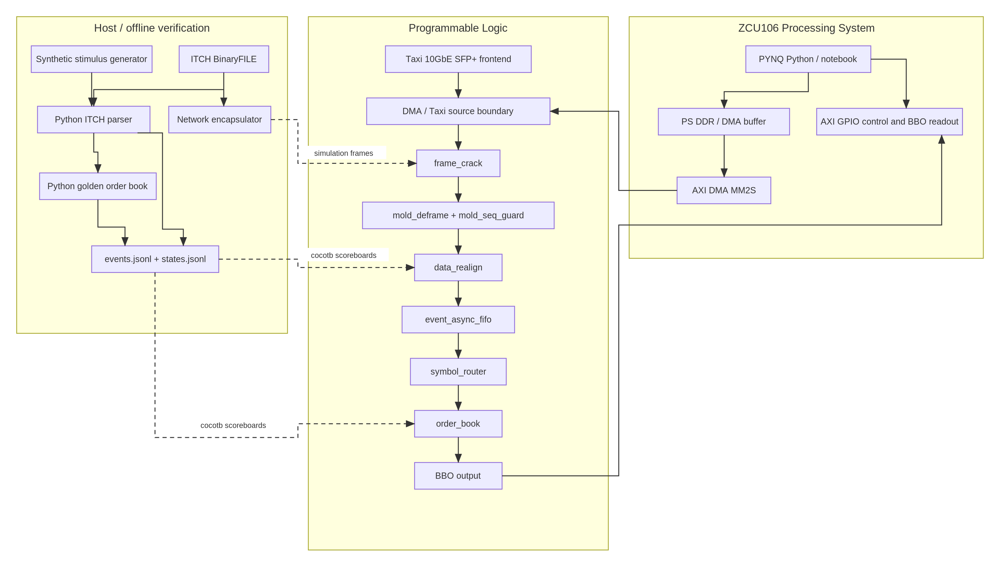

# ITCH 5.0 Feed Handler and FPGA Hardware Order Book

---

## Overview

We currently have a complete simulated native 64-bit path from market data wrapped in Ethernet frames to a hardware-maintained BBO:



The host-side PS in Python generates network frames and expected book states. Cocotb/Verilator tests network parsing, sequence handling, message decoding, order book, and the complete network-to-book path.

The current ZCU106 Vivado build also integrates a **Taxi-based 10GbE SFP+ frontend**, but we are not able to fully test it until we get a machine with 10Gbit SFP+ ports

For the latest design, we have the ingress running at Taxi's clock, and the Order book running at 250MHz

---

## ZCU106 hardware model

One of the benefits of the ZCU106 is that it provides SFP+ cages connected to UltraScale+ GTH transceivers in the Programmable Logic. The current design therefore supports a direct hardware Ethernet path into the PL rather than requiring packets to pass through the Processing System.


### Taxi 10GbE frontend

The Taxi integration uses the ZCU106's two SFP+ GTH lanes and a **64-bit Taxi MAC/PCS datapath**. The current ITCH path consumes lane 0 RX; the second physical lane remains present in the frontend but is not currently used for feed processing. We do need a little rewiring to match the required input into the network ingress

The frontend also exposes link/debug status including GT power-good, RX status, block lock, BER/error count and bad-FCS indications for physical bring-up. We currently have an ILA connected for future debug

---

## Protocol and book model

The order book allows us to take in ITCH messages and maintain price books and output BBO.

<picture>
  <source media="(prefers-color-scheme: dark)" srcset="docs/images/architecture_dark.png">
  <source media="(prefers-color-scheme: light)" srcset="docs/images/architecture_light.png">
  
</picture>

### Important ITCH message types

| Type | Name | Effect |
|---|---|---|
| `A` | Add Order | Insert displayed order |
| `F` | Add Order with MPID | Same as ADD, MPID we don't care about |
| `E` | Order Executed | Reduce shares using the referenced order's stored side and price |
| `C` | Order Executed with Price | Reduce displayed shares; the displayed level still comes from the order table |
| `X` | Order Cancel | Reduce displayed shares |
| `D` | Order Delete | Remove all remaining displayed shares |
| `U` | Order Replace | Remove the old reference and insert the replacement using the inherited side |

We still parse other ITCH messages through much of the ingress, but once we actually get to the decoder, we can throw them away

### Data representation

- ITCH integers are parsed as **big-endian unsigned integers**.
- ITCH `Price(4)` values are modified in the PS to have a \$0.01 tick
(rather than the original $0.0001)
- The RTL price and configured base price use the same integer unit.
- The hardware price book is a bounded dense window indexed relative to the configured base price.
- Real multi-symbol data is filtered or routed before it enters an individual hardware book.

---

## RTL datapath

Detailed contracts, parsing assumptions, backpressure behaviour, and per-stage responsibilities are documented in [`docs/rtl_datapath.md`](docs/rtl_datapath.md).

| Stage | Responsibility |
|---|---|
| `frame_crack` | Validate the supported Ethernet/IPv4/UDP header shape and emit the UDP payload |
| `mold_deframe` | Parse MoldUDP64 metadata, remove two-byte message-length prefixes and emit packed ITCH payload bytes plus message-length tokens |
| `mold_seq_guard` | Accept in-order/post-gap packets, suppress duplicates, and report stale/gap state |
| `data_realign` | Track message boundaries directly in the packed 64-bit payload stream and decode `A/F/E/C/X/D/U` into the normalised event contract |
| `event_async_fifo` | Cross complete normalised events from the network clock domain into the 250 MHz data/order-book domain |
| `symbol_router` | Select the configured instrument/book and insert a register boundary |
| `order_book` | Resolve order references, update aggregate price levels, and emit BBO updates |

The previous separate `realign -> data_handler` path remains useful as a behavioural/reference implementation, but the current packaged Vivado ingress uses the merged `data_realign` path to avoid recreating a padded AXI packet for every ITCH message.

MoldUDP64 sequencing and recovery policy are documented separately in [`docs/moldudp64_seq_handling.md`](docs/moldudp64_seq_handling.md).

---

## Golden model and verification

The Python golden model is the functional source of truth. It converts BinaryFILE records into normalised events, replays those events through a reference order book, and writes matched `events.jsonl` and `states.jsonl` oracle streams for RTL comparison.

The golden-model architecture, verification layers, current coverage, and remaining proof gaps are consolidated in [`docs/golden_model.md`](docs/golden_model.md). Environment setup is in [`docs/environment.md`](docs/environment.md), and all commands for running the repository are in [`docs/running_the_project.md`](docs/running_the_project.md).

---

## Vivado and ZCU106 build

### Current block design


The hardware build remains modular. The DMA is **MM2S-only** and provides the deterministic replay source, while Taxi provides the real SFP+ Ethernet source. The DMA stream is clock-converted into the Taxi RX/user clock domain before the two sources meet at the static mux.

The 64-bit network ingress runs from the Taxi RX/user clock. Once a complete normalised event has been decoded, `event_async_fifo` crosses the event into the 250 MHz order-book domain.

### Address map

| Peripheral | Base address | Direction / use |
|---|---|---|
| AXI DMA | `0x80040000` | PS control; MM2S frame input |
| Bid BBO GPIO | `0x80030000` | PL to PS; bid price and shares |
| Ask BBO GPIO | `0x80020000` | PL to PS; ask price and shares |
| meta GPIO (valid bit) | `0x80010000` | PL to PS; update indication |
| Base-price GPIO | `0x80000000` | PS to PL; price-window base |
| Base-price 2 GPIO | `0x80050000` | PS to PL; price-window base |

> Note that multiple base price GPIOs are used for 2 stocks each

---

## Measured implementation results

Reports on these values can be found in [`implementation_reports`](implementation_reports).

Latest routed build captured on **12th September 2026**:

| Item | Result |
|---|---:|
| Vivado version | 2023.2 |
| Project | `Feed_Handler_v3.0` |
| Target board | ZCU106 |
| SFP+ MGT reference clock | **156.25 MHz / 6.400 ns** |
| Routed Taxi RX/user clock | **~161.13 MHz / 6.206 ns** |
| Order Book clock | **250 MHz / 4.000 ns** |
| WNS | **+0.003   ns** |
| TNS | **0.000 ns** |
| WHS | **+0.010 ns** |
| THS | **0.000 ns** |

All user-specified timing constraints are met and the implementation run completes through bitstream generation.

### Utilisation

| Resource | Used | Available | Utilisation |
|---|---:|---:|---:|
| LUTs | 43,336 | 230,400 | 18.81% |
| LUTRAM / LUT memory | 1,911 | 101,760 | 1.88% |
| Flip-Flops | 49,874 | 460,800 | 10.82% |
| Block RAM | 51.5 | 312 | 16.51% |
| Ultra RAM | 24 | 96 | 25.00% |
| DSPs | 0 | 1728 | 0.00% |
| GTH channels | 2 | 20 | 10.00% |

---

## Latency and throughput design decisions

The ingress measurements below use the **156.25 MHz** simulation clock used for the native 64-bit line-rate regression. The latest routed Taxi RX/user clock is slightly different, as shown in the implementation table above. The data/order-book domain remains at **250 MHz**.

### Network ingress

| Stage | First output / completion | Sustained behaviour | Current limiter |
|---|---|---|---|
| `frame_crack` | UDP/MoldUDP64 forwarding begins after the fixed **42-byte** Ethernet/IPv4/UDP prefix; with 64-bit beats the first payload bytes occur in beat 5 | Up to one **64-bit beat per cycle** after payload streaming begins | Fixed header arrival and the 42-byte-to-8-byte alignment |
| `mold_deframe` + sequence guard | The 20-byte MoldUDP64 header is decoded across three 64-bit beats before body processing | Parallel body parser handles up to **8 raw bytes/cycle** with registered descriptor/compaction stages | Message-boundary classification and compaction, rather than the old byte-serial parser |
| `data_realign` | **9 cycles / 57.6 ns** from the final Ethernet beat to the normalised event in the cold-latency sweep | Accepts a complete packed 64-bit payload beat per cycle in the common case and decodes directly to `data_t` | Event-output capacity/backpressure rather than a separate per-message realignment stage |
| Complete ingress + decode | **19 cycles / 121.6 ns** for `D/X`, **20 / 128.0 ns** for `E`, and **21 / 134.4 ns** for `U/A/C/F` from first Ethernet beat to event | Measured **9.830-9.911 Gbit/s** across the supported message campaigns; all campaigns pass the calculated physical 10GbE wire-rate gate | A small number of zero-gap AXI stress stalls remain around the `frame_crack -> mold_deframe` boundary, but they do not prevent physical 10GbE-rate operation |

The final native-64-bit line-rate campaign measured:

```text
D:     9.911 Gbit/s
X:     9.906 Gbit/s
E:     9.866 Gbit/s
U:     9.870 Gbit/s
A:     9.902 Gbit/s
C:     9.902 Gbit/s
F:     9.911 Gbit/s
Mixed: 9.830 Gbit/s
```

These figures are measured on the AXI frame path while the pass/fail gate accounts for Ethernet preamble/SFD, FCS and inter-frame gap. This is why the required MAC-side rate is slightly below a literal 10.000 Gbit/s for normal Ethernet traffic.

### Decoder and order book

| Stage | Latency | Initiation behaviour | Reason for the decision |
|---|---|---|---|
| `data_realign` | Included in the **19-21 cycle** ingress/decode figures above | Direct packed-stream decode avoids the old `realign -> data_handler` per-message bubble | Merging realignment and decode removes duplicated byte movement and improves sustained ingress throughput |
| `event_async_fifo` | CDC/buffering latency only; no protocol processing | Decouples the fast network domain from the 250 MHz order-book domain | Crossing complete 217-bit events is simpler and lower bandwidth than crossing raw Ethernet data |
| `symbol_router` | **1 cycle / 4 ns** | Up to one accepted event per cycle when the selected book is ready | The register boundary isolates decoder timing from the book and provides clean routing control |
| `order_book` | **16-stage pipeline / 64 ns** at 250 MHz | Pipeline latency is separate from initiation rate; successive events can occupy different stages concurrently | Pipelining removes the old state-machine throughput limit while retaining the BRAM-based order and price books |


---

## Further documentation

- [`docs/environment.md`](docs/environment.md) — host toolchain and Vivado environment setup
- [`docs/running_the_project.md`](docs/running_the_project.md) — golden-model, cocotb, vector-generation, xsim, formatting, and cleanup commands
- [`docs/golden_model.md`](docs/golden_model.md) — golden-model architecture and consolidated verification methodology
- [`docs/rtl_datapath.md`](docs/rtl_datapath.md) — RTL stage contracts, handshakes, and design boundaries
- [`docs/networking_ingress.md`](docs/networking_ingress.md) — detailed Ethernet/IPv4/UDP/MoldUDP64 ingress behaviour
- [`docs/moldudp64_seq_handling.md`](docs/moldudp64_seq_handling.md) — duplicate, gap, stale, heartbeat, and EOS policy
- [`docs/order_book.md`](docs/order_book.md) — v2 hardware order-book implementation
- [`docs/pipelined_order_book.md`](docs/pipelined_order_book.md) - v3 varient of the order book specifically
- [`docs/proccessing_system.md`](docs/processing_system.md) - Processing system used to run the project

---

## Licensing

Project-specific software, documentation and independently authored components are provided under the repository's [MIT licence](LICENSE) unless otherwise stated.

The V4.0 FPGA hardware design integrates the [Taxi transport library](https://github.com/fpganinja/taxi), whose core RTL is provided under the **CERN Open Hardware Licence Version 2 - Strongly Reciprocal (CERN-OHL-S-2.0)** unless an individual Taxi file states otherwise.

The V4.0 licensing scope, third-party attribution and source information are documented in [`releases/v4.0/LICENSE.md`](releases/v4.0/LICENSE.md).

---

## Contributors

Built collaboratively by:

- [Anthony Bartlett](https://github.com/an-thony350)
- [Denzil Erza-Essien](https://github.com/derza-essien)

Both contributors worked across the FPGA architecture, RTL implementation, verification, hardware integration and system bring-up.

---

## Continuous integration

GitHub Actions runs repository checks, deterministic golden-model generation, and the full cocotb/Verilator RTL regression on pushes to `main` and pull requests. A separate performance workflow runs smoke tests for relevant changes and a scheduled full campaign, with oracle, diagnostic, and performance artifacts retained for inspection.
