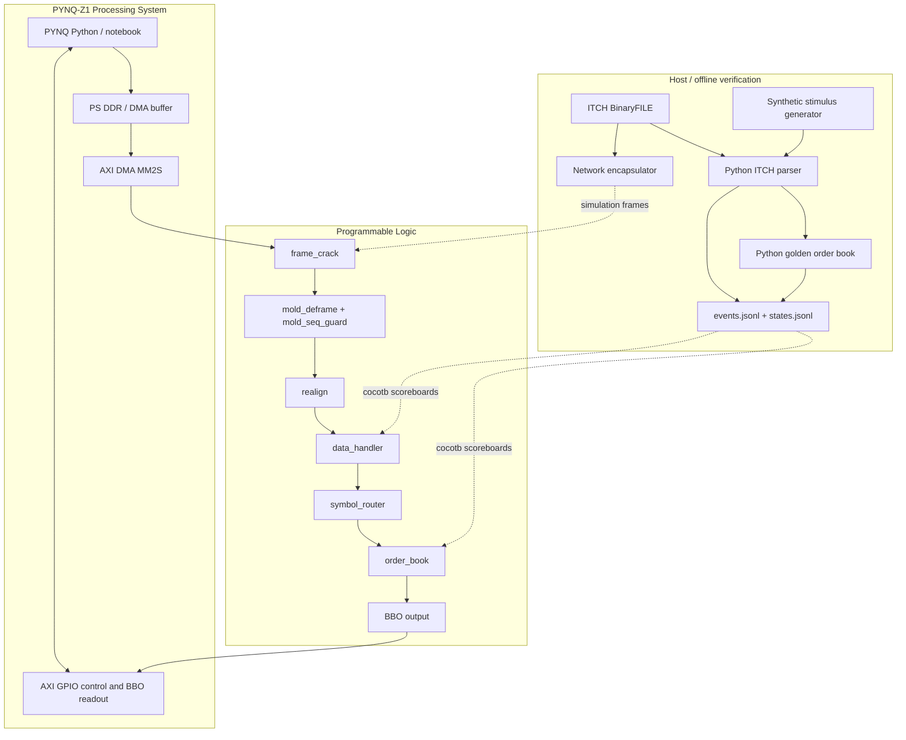
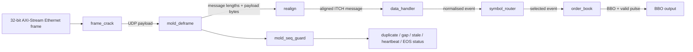
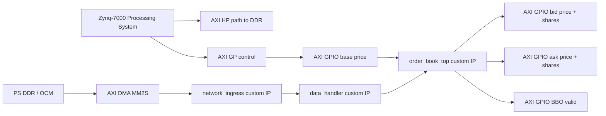

# ITCH 5.0 Feed Handler and FPGA Hardware Order Book

SystemVerilog RTL, Python reference models, and layered verification for a Nasdaq TotalView-ITCH 5.0-style feed handler and hardware order book.

The project accepts Ethernet II / IPv4 / UDP / MoldUDP64-style frames, recovers variable-length ITCH messages, decodes displayed-book events, maintains price-level state, and emits best-bid/best-offer updates. The current real-silicon target is the **PYNQ-Z1 / Zynq-7020**, with frames replayed from the Processing System into the Programmable Logic through AXI DMA.

---

## Contents

- [ITCH 5.0 Feed Handler and FPGA Hardware Order Book](#itch-50-feed-handler-and-fpga-hardware-order-book)
  - [Contents](#contents)
  - [Project status](#project-status)
  - [System architecture](#system-architecture)
    - [Host, Processing System, and Programmable Logic](#host-processing-system-and-programmable-logic)
    - [PL hot path](#pl-hot-path)
  - [PYNQ-Z1 hardware model](#pynq-z1-hardware-model)
  - [Protocol and book model](#protocol-and-book-model)
    - [Relevant ITCH message types](#relevant-itch-message-types)
    - [Data representation](#data-representation)
  - [RTL datapath](#rtl-datapath)
  - [Golden model and verification](#golden-model-and-verification)
  - [Vivado and PYNQ-Z1 build](#vivado-and-pynq-z1-build)
    - [Current block design](#current-block-design)
    - [Address map](#address-map)
  - [Measured implementation results](#measured-implementation-results)
    - [Top-level utilisation](#top-level-utilisation)
    - [Network-ingress utilisation](#network-ingress-utilisation)
  - [Latency and throughput design decisions](#latency-and-throughput-design-decisions)
    - [Network ingress](#network-ingress)
    - [Decoder and order book](#decoder-and-order-book)
    - [Optimisation order](#optimisation-order)
  - [Further documentation](#further-documentation)

---

## Project status

As of **27 July 2026**, the project has a complete simulated path from encapsulated market-data-style Ethernet frames to a hardware-maintained BBO:

```text
Ethernet II -> IPv4 -> UDP -> MoldUDP64 -> ITCH realignment
    -> ITCH decode -> symbol routing -> order book -> BBO
```

The host-side Python flow generates deterministic BinaryFILE stimulus, network frames, normalised events, and expected book states. Cocotb/Verilator tests exercise the parser, sequence handling, decoder, order book, and complete network-to-book path. The latest PYNQ-Z1 implementation is routed, timing-clean at **106.667 MHz**, and has a generated bitstream.

The current hardware demonstration uses **PS-to-PL DMA replay**, rather than direct Ethernet into the FPGA fabric. Automated board-versus-golden replay, complete internal-table comparison after every event, and tick-to-trade egress remain future work.

---

## System architecture

### Host, Processing System, and Programmable Logic


```mermaid
flowchart TB
    subgraph HOST[Host / offline verification]
        BIN[ITCH BinaryFILE]
        STIM[Synthetic stimulus generator]
        GP[Python ITCH parser]
        GB[Python golden order book]
        ENC[Network encapsulator]
        ORA[events.jsonl + states.jsonl]

        BIN --> GP
        STIM --> GP
        GP --> GB
        GP --> ORA
        GB --> ORA
        BIN --> ENC
    end

    subgraph PS[PYNQ-Z1 Processing System]
        PY[PYNQ Python / notebook]
        DDR[PS DDR / DMA buffer]
        DMA[AXI DMA MM2S]
        GPIO[AXI GPIO control and BBO readout]

        PY --> DDR --> DMA
        PY <--> GPIO
    end

    subgraph PL[Programmable Logic]
        FC[frame_crack]
        MD[mold_deframe + mold_seq_guard]
        RA[realign]
        DH[data_handler]
        SR[symbol_router]
        OB[order_book]
        BBO[BBO output]

        FC --> MD --> RA --> DH --> SR --> OB --> BBO
    end

    ENC -. simulation frames .-> FC
    DMA --> FC
    BBO --> GPIO
    ORA -. cocotb scoreboards .-> DH
    ORA -. cocotb scoreboards .-> OB
```

### PL hot path


```mermaid
flowchart LR
    A[32-bit AXI-Stream Ethernet frame] --> B[frame_crack]
    B -->|UDP payload| C[mold_deframe]
    C -->|message lengths + payload bytes| D[realign]
    D -->|aligned ITCH message| E[data_handler]
    E -->|normalised event| F[symbol_router]
    F -->|selected event| G[order_book]
    G -->|BBO + valid pulse| H[BBO output]

    C --> I[mold_seq_guard]
    I --> J[duplicate / gap / stale / heartbeat / EOS status]
```

The stages are separated so they can be tested independently before being integrated into the complete path.

---

## PYNQ-Z1 hardware model

The PYNQ-Z1 Ethernet connector is attached to the Zynq **Processing System**, not directly to the Programmable Logic. The current board path therefore replays generated frames from PS DDR through an MM2S AXI DMA into the same AXI-Stream ingress interface used in simulation.

A future direct-wire version requires a networking FPGA board whose Ethernet MAC, PHY, or SFP/QSFP transceiver path is accessible from the PL fabric. On that platform, the DMA source can be replaced by a MAC/CMAC stream while retaining the downstream protocol and book pipeline.

---

## Protocol and book model

Nasdaq TotalView-ITCH describes the lifecycle of individual displayed orders. The feed handler reconstructs the book; it does not match orders.


```mermaid
flowchart LR
    A[ITCH L3 order messages] --> B[Order-reference table]
    B --> C[Per-price bid/ask aggregates]
    C --> D[Best bid / best ask]
```

### Relevant ITCH message types

| Type | Name | RTL / golden treatment |
|---|---|---|
| `R` | Stock Directory | Golden model resolves symbol to the daily stock-locate code; not a book mutation |
| `A` | Add Order | Insert displayed order |
| `F` | Add Order with MPID | Insert displayed order; attribution is ignored for book state |
| `E` | Order Executed | Reduce shares using the referenced order's stored side and price |
| `C` | Order Executed with Price | Reduce displayed shares; the displayed level still comes from the order table |
| `X` | Order Cancel | Reduce displayed shares |
| `D` | Order Delete | Remove all remaining displayed shares |
| `U` | Order Replace | Remove the old reference and insert the replacement using the inherited side |

Other ITCH messages may still pass through MoldUDP64 sequencing, but messages that do not mutate the displayed book are ignored by the decoder.

### Data representation

- ITCH integers are parsed as **big-endian unsigned integers**.
- ITCH `Price(4)` values are kept as integers with four implied decimal places.
- The RTL price and configured base price use the same integer unit.
- The hardware price book is a bounded dense window indexed relative to the configured base price.
- Real multi-symbol data is filtered or routed before it enters an individual hardware book.

---

## RTL datapath

The top-level README keeps only the stage boundaries. Detailed contracts, parsing assumptions, backpressure behaviour, and per-stage responsibilities are documented in [`docs/rtl_datapath.md`](docs/rtl_datapath.md).

| Stage | Responsibility |
|---|---|
| `frame_crack` | Validate the supported Ethernet/IPv4/UDP header shape and emit the UDP payload |
| `mold_deframe` | Parse MoldUDP64 metadata and split length-prefixed ITCH message blocks |
| `mold_seq_guard` | Accept in-order/post-gap packets, suppress duplicates, and report stale/gap state |
| `realign` | Convert unaligned payload bytes into one aligned AXI packet per ITCH message |
| `data_handler` | Decode `A/F/E/C/X/D/U` messages into the internal event contract |
| `symbol_router` | Select the configured instrument/book and insert a register boundary |
| `order_book` | Resolve order references, update aggregate price levels, and emit BBO updates |

MoldUDP64 sequencing and recovery policy are documented separately in [`docs/moldudp64_sequence_handling.md`](docs/moldudp64_sequence_handling.md).

---

## Golden model and verification

The Python golden model is the functional source of truth. It converts BinaryFILE records into normalised events, replays those events through a reference order book, and writes matched `events.jsonl` and `states.jsonl` oracle streams for RTL comparison.

The golden-model architecture, verification layers, current coverage, and remaining proof gaps are consolidated in [`docs/golden_model.md`](docs/golden_model.md). Environment setup is in [`docs/environment.md`](docs/environment.md), and all commands for running the repository are in [`docs/running_the_project.md`](docs/running_the_project.md).

---

## Vivado and PYNQ-Z1 build

### Current block design


```mermaid
flowchart LR
    PS7[Zynq-7000 Processing System] --> HP[AXI HP path to DDR]
    PS7 --> GP[AXI GP control]
    DDR[PS DDR / OCM] --> DMA[AXI DMA MM2S]
    DMA --> NI[network_ingress custom IP]
    NI --> DH[data_handler custom IP]
    DH --> OBT[order_book_top custom IP]
    OBT --> BID[AXI GPIO bid price + shares]
    OBT --> ASK[AXI GPIO ask price + shares]
    OBT --> VAL[AXI GPIO BBO valid]
    GP --> BASE[AXI GPIO base price]
    BASE --> OBT
```

The hardware build uses modular Vivado IP blocks. The DMA is **MM2S-only**: frames move from PS memory into the PL, while BBO values and configuration are exposed through AXI GPIO.

### Address map

| Peripheral | Base address | Direction / use |
|---|---:|---|
| AXI DMA | `0x40400000` | PS control; MM2S frame input |
| Bid BBO GPIO | `0x41200000` | PL to PS; bid price and shares |
| Ask BBO GPIO | `0x41210000` | PL to PS; ask price and shares |
| BBO-valid GPIO | `0x41220000` | PL to PS; update indication |
| Base-price GPIO | `0x41230000` | PS to PL; price-window base |

---

## Measured implementation results

Latest routed build captured on **27 July 2026**:

| Item | Result |
|---|---:|
| Vivado version | 2023.2 |
| Project | `Feed_Handler_v1.0` |
| Target board | PYNQ-Z1 |
| Clock period | **9.375 ns** |
| Clock frequency | **106.667 MHz** |
| WNS | **+0.047 ns** |
| TNS | **0.000 ns** |

### Top-level utilisation

| Resource | Used | Available | Utilisation |
|---|---:|---:|---:|
| Slice LUTs | 10,226 | 53,200 | 19.22% |
| Slice registers | 6,189 | 106,400 | 5.82% |
| Block RAM tiles | 90.5 | 140 | 64.64% |
| DSPs | 0 | 220 | 0.00% |

### Network-ingress utilisation

| Hierarchy | LUTs | Registers | BRAM |
|---|---:|---:|---:|
| Complete `network_ingress` | 823 | 677 | 0 |
| `frame_crack` | 320 | 172 | 0 |
| `mold_deframe`, including sequence guard | 378 | 358 | 0 |
| `realign` | 140 | 147 | 0 |

The routed design is primarily **BRAM-constrained**, not LUT-, register-, or DSP-constrained. This favours performance improvements that spend LUTs and registers on parallel byte handling while avoiding additional block-memory structures.

---

## Latency and throughput design decisions

The cycle counts below assume no downstream backpressure and use the routed **106.667 MHz** clock. Nanosecond figures are rounded from the 9.375 ns period.

### Network ingress

| Stage | First output / completion | Sustained behaviour | Current limiter |
|---|---|---|---|
| `frame_crack` | **11 cycles / 103.1 ns** to the first MoldUDP64 beat | Up to one 32-bit beat per cycle after the fixed header | The 42-byte Ethernet/IPv4/UDP prefix must arrive before payload forwarding |
| `mold_deframe` + sequence guard | **24 cycles / 225.0 ns** to sequence status; about **33 cycles / 309.4 ns** to the first ITCH-payload beat | About four payload bytes per six cycles, approximately **0.569 Gbit/s** | A stored 32-bit beat is consumed one byte per cycle, with output and length-token handshakes |
| `realign` | About **4 cycles / 37.5 ns** to the first aligned ITCH beat | About four payload bytes per six cycles, approximately **0.569 Gbit/s** | The stage repeats byte-serial unpacking and repacking and cannot accept a new beat while holding one |
| Complete ingress | About **50 cycles / 468.8 ns** from the first Ethernet beat to the first aligned ITCH beat | Raw recovered-ITCH ceiling of about **0.569 Gbit/s** | Duplicated byte-serial work in `mold_deframe` and `realign` |

`frame_crack` is already close to the minimum latency imposed by receiving a 42-byte header over a 32-bit interface. The highest-value ingress change is therefore to process all four byte lanes per cycle in `mold_deframe`, followed by a small register/LUT byte reservoir in `realign` that can accept and emit a beat in the same cycle.

### Decoder and order book

| Stage | Latency | Initiation behaviour | Reason for the decision |
|---|---|---|---|
| `data_handler` | About **4-9 cycles / 37.5-84.4 ns**, depending on ITCH message length | First-beat interval of roughly **6-11 cycles** | One message is accumulated and then held in `SEND` until the event is accepted |
| `symbol_router` | **1 cycle / 9.375 ns** | Up to one accepted event per cycle when the selected book is ready | The register boundary isolates decoder timing from the book and provides clean routing control |
| `order_book` | About **9 cycles / 84.4 ns** in the collision-free, no-rescan common case | About **10 cycles** per common event, or **10.67 million events/s** | Synchronous BRAM reads and a serial update FSM provide deterministic ordering without overlapping RMW hazards |

Replace adds approximately one cycle, an emptied best level adds approximately two search cycles, and each additional hash probe adds approximately two cycles. The serial book deliberately prioritises correctness and bounded operation-dependent latency over an initiation interval of one. A pipelined version would require explicit same-reference and same-level forwarding or stalls.

### Optimisation order

1. **Instrument first.** Record cycle timestamps at each AXI handshake and at event/BBO validity so intrinsic latency is separated from backpressure queueing.
2. **Parallelise `mold_deframe`.** Consume all four byte lanes each cycle. The target is sequence validity in roughly 5-6 cycles and payload output at one 32-bit beat per cycle.
3. **Use a reservoir aligner.** Replace byte-at-a-time realignment with a small register/LUT reservoir capable of simultaneous input and output. This avoids adding pressure to the already constrained BRAM budget.
4. **Add skid buffers only where useful.** A one-beat skid buffer may add one isolated cycle, but can remove bubbles, register `tready`, and improve timing predictability.
5. **Widen only after using the current bus.** The raw 32-bit interface already provides **3.413 Gbit/s** at 106.667 MHz; the current loss is architectural utilisation, not bus width.

The routed worst setup path is in the order-book memory path, from an order-table BRAM output through price-index/control logic to a price-book BRAM address. It has **8.492 ns** data-path delay, six logic levels, and approximately equal logic and routing delay. Increasing the global clock is therefore not the first ingress optimisation: the immediate objective is fewer cycles and fewer message-boundary bubbles at the existing timing-clean frequency.

---

## Further documentation

- [`docs/environment.md`](docs/environment.md) — host toolchain and Vivado environment setup
- [`docs/running_the_project.md`](docs/running_the_project.md) — golden-model, cocotb, vector-generation, xsim, formatting, and cleanup commands
- [`docs/golden_model.md`](docs/golden_model.md) — golden-model architecture and consolidated verification methodology
- [`docs/rtl_datapath.md`](docs/rtl_datapath.md) — RTL stage contracts, handshakes, and design boundaries
- [`docs/networking_ingress.md`](docs/networking_ingress.md) — detailed Ethernet/IPv4/UDP/MoldUDP64 ingress behaviour
- [`docs/moldudp64_sequence_handling.md`](docs/moldudp64_sequence_handling.md) — duplicate, gap, stale, heartbeat, and EOS policy
- [`docs/data_handler.md`](docs/data_handler.md) — ITCH decoder details
- [`docs/order_book.md`](docs/order_book.md) — hardware order-book implementation
