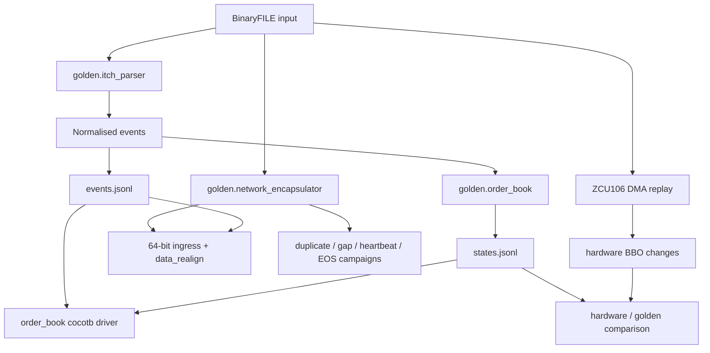

# Golden Model and Verification

The golden model consumes ITCH BinaryFILE input, normalises book-mutating messages into a stable event contract, replays those events through a reference order book, and emits matched JSONL oracle streams for RTL comparison.

It is the functional source of truth for the project. The Python is deliberately clear and explicit rather than optimised to resemble the hardware implementation.

Commands for generating the oracles and running the RTL tests are kept in [`running_the_project.md`](running_the_project.md) so this document remains focused on architecture, contracts, and proof scope.

---

## 1. Verification architecture



The verification stack is layered so that failures can be localised:

```text
Python unit tests
    -> decoder isolation
    -> order-book isolation
    -> router/book integration
    -> native 64-bit network-ingress verification
    -> line-rate ingress regression
    -> sequence / duplicate / gap campaigns
    -> ZCU106 hardware-versus-golden comparison
    -> implementation timing and resources
```

The older `data_handler`, `ingress_top`, and `feed_handler_top` paths remain in the repository as useful regression/reference implementations, but the current Vivado ingress uses the merged native-64-bit `data_realign` path.

---

## 2. Source files

| File | Role |
|---|---|
| `golden/contracts.py` | Frozen dataclasses and enums: `NormalisedEvent`, `BookState`, `Bbo`, `Level`, `Op`, and `Side` |
| `golden/itch_parser.py` | BinaryFILE reader, ITCH message decoder, Stock Directory parsing, and symbol-to-locate resolution |
| `golden/order_book.py` | Reference displayed order book |
| `golden/stimulus.py` | Directed and seeded-random synthetic BinaryFILE generator |
| `golden/runner.py` | Parser/book entry point that emits the matched JSONL streams |
| `golden/network_encapsulator.py` | BinaryFILE to MoldUDP64/UDP/IPv4/Ethernet vector generator |
| `golden/tests/` | Parser, book, stimulus, runner, and encapsulator unit tests |
| `tb/itch_harness/` | Cocotb layouts, drivers, oracle loading, AXI helpers, and scoreboards |

---

## 3. Input format

The golden model consumes Nasdaq ITCH **BinaryFILE** records:

```text
2-byte big-endian message length
ITCH payload bytes
2-byte big-endian message length
ITCH payload bytes
...
```

The two-byte length prefix is not part of the ITCH message. `iter_binaryfile_payloads()` strips the prefix and yields:

```python
(msg_index, payload)
```

`msg_index` counts every source record, including ignored messages. That index is retained in the oracle so a scoreboard can report the exact feed position of the first divergence.

Public BinaryFILE samples do not contain Ethernet, IPv4, UDP, or MoldUDP64 headers. The network encapsulator synthesises those layers from the same source payloads used by the parser.

---

## 4. Normalised event contract

The parser maps the supported ITCH messages into one internal Python shape:

```python
@dataclass(frozen=True)
class NormalisedEvent:
    op: Op
    locate: int
    side: Side
    order_ref: int
    msg_index: int
    price: Optional[int] = None
    shares: Optional[int] = None
    new_order_ref: Optional[int] = None
    timestamp_ns: Optional[int] = None
```

| Operation | Required event fields |
|---|---|
| `ADD` | locate, side, order reference, price, shares |
| `EXECUTE` | locate, order reference, executed shares |
| `CANCEL` | locate, order reference, cancelled shares |
| `DELETE` | locate and order reference |
| `REPLACE` | locate, original reference, new reference, new price, new shares |

The assertions in `contracts.py` are part of the oracle contract. They stop malformed parser output from silently entering the reference book.

---

## 5. ITCH messages decoded

| ITCH type | Name | Normalised operation | Book treatment |
|---|---|---|---|
| `A` | Add Order | `ADD` | Insert displayed order |
| `F` | Add Order with MPID | `ADD` | Same as `A`; attribution is ignored |
| `E` | Order Executed | `EXECUTE` | Reduce displayed shares; price comes from the stored order |
| `C` | Order Executed with Price | `EXECUTE` | Same displayed-book mutation as `E`; execution price is not the displayed level |
| `X` | Order Cancel | `CANCEL` | Partially reduce displayed shares |
| `D` | Order Delete | `DELETE` | Remove all remaining displayed shares |
| `U` | Order Replace | `REPLACE` | Delete old reference and add the replacement with inherited side |

Stock Directory messages (`R`) are handled separately to resolve a symbol to its daily locate code. Administrative, trade, auction, and other messages that do not mutate the displayed book are ignored by `parse_itch_message()`.

---

## 6. Symbol and locate filtering

Real ITCH data is multi-symbol, while an individual hardware book covers one routed instrument and a bounded price window. The runner therefore supports:

- direct filtering by a known stock-locate code;
- symbol filtering by first resolving the daily locate from Stock Directory messages.

Symbol and locate filters are mutually exclusive. Unfiltered real input should only be used deliberately, because combining different instruments into one single-instrument oracle would produce an invalid comparison.

The hardware replay flow discovers the real locate from Stock Directory messages and rewrites the selected hardware symbols to the routed locate IDs used by the PL. The golden and hardware comparison must therefore use the same selected instrument.

---

## 7. Reference order-book behaviour

The Python book maintains:

```text
order_table: order_ref -> {side, price, shares, locate}
bid_levels: price -> {aggregate shares, order count}
ask_levels: price -> {aggregate shares, order count}
```

| Operation | Order-table mutation | Price-level mutation |
|---|---|---|
| `ADD` | Insert a new reference | Increase shares and order count |
| `EXECUTE` | Reduce remaining shares; remove at zero | Reduce aggregate shares; decrement count only when the order dies |
| `CANCEL` | Same remaining-share semantics as execute | Same aggregate semantics as execute |
| `DELETE` | Remove the order | Remove all remaining shares and decrement count |
| `REPLACE` | Remove old reference and insert new reference | Validate then apply delete-and-add using the inherited side |

BBO is derived from occupied levels:

```text
best bid = highest occupied bid price
best ask = lowest occupied ask price
```

Empty sides are `None` in Python and `null` in JSON.

---

## 8. Matched oracle files

The default oracle directory contains:

```text
build/golden/itch_synthetic.bin
build/golden/events.jsonl
build/golden/states.jsonl
```

| Output | Meaning | Primary use |
|---|---|---|
| `itch_synthetic.bin` | Length-prefixed BinaryFILE stimulus | Common input for parser and RTL replay |
| `events.jsonl` | One normalised accepted book event per row | Decoder isolation and direct book input |
| `states.jsonl` | Expected post-event book snapshot | Book and BBO/state comparison |

Row `n` in `events.jsonl` and row `n` in `states.jsonl` refer to the same accepted event and source `msg_index`.

Example event:

```json
{"msg_index":1,"op":"ADD","locate":1,"side":"BUY","order_ref":1001,"price":10000,"shares":100,"new_order_ref":null,"timestamp_ns":100}
```

Example state:

```json
{
  "msg_index": 1,
  "bbo": {"bid_price": 10000, "bid_size": 100, "ask_price": null, "ask_size": null},
  "bid_levels": [{"price": 10000, "shares": 100, "order_count": 1}],
  "ask_levels": []
}
```

Bids are written in descending price order and asks in ascending price order so diffs remain deterministic.

---

## 9. Cocotb verification layers

| Target | Test module | Main checks |
|---|---|---|
| `mold_seq_guard` | `test_mold_seq_guard.py` | First packet, in-order, duplicate, gap, heartbeat, EOS, and sticky stale behaviour |
| `data_realign` | `test_data_realign.py` | Direct packed-message decode, message boundaries, supported/ignored types, malformed input, and backpressure |
| `ingress_data_realign_top` | `test_ingress_data_realign.py` | Current native-64-bit Ethernet/MoldUDP64-to-normalised-event path |
| `ingress_data_realign_perf_probe` | `test_ingress_data_realign_perf.py` | Current ingress/decode latency instrumentation |
| `ingress_data_realign_perf_probe` | `test_ingress_data_realign_line_rate.py` | Native-64-bit line-rate regression |
| `order_book` | `test_order_book.py` | Lifecycle, aggregation, collisions, replace cases, boundaries, reset, deterministic random streams, and oracle BBO replay |
| `order_book_top` | `test_order_book_top.py` | Symbol routing, base-price forwarding, wrapper behaviour, and replay |
| `lane_rewire` / source mux | `test_lane_rewire.py`, `test_axis_source_mux.py`, `test_source_boundary_equiv.py` | Taxi byte-lane conversion and equivalence of the DMA/Taxi source boundary |

The repository also retains cocotb tests for the older `data_handler`, `ingress_top`, and `feed_handler_top` path. These remain useful regression tests, but they are not the architecture instantiated by the current Vivado `network_ingress` IP.

### Current network campaigns

The current native-64-bit ingress campaigns include:

- one and multiple ITCH messages per MoldUDP64 packet;
- different ITCH message lengths and 64-bit beat alignments;
- messages that cross input beats;
- downstream backpressure;
- exact packet duplicates;
- sequence gaps and late packets;
- heartbeat and EOS packets without book mutation;
- malformed-frame and malformed-MoldUDP64 error handling;
- line-rate message campaigns for all supported book-mutating ITCH types and mixed traffic.

A/B duplicate testing is logical duplicate traffic presented to a common ingress. It proves duplicate suppression, not arbitration between two physical network receivers.

---

See [`running_the_project.md`](running_the_project.md) for executable commands and [`processing_system.md`](processing_system.md) for the ZCU106 notebook flow.
