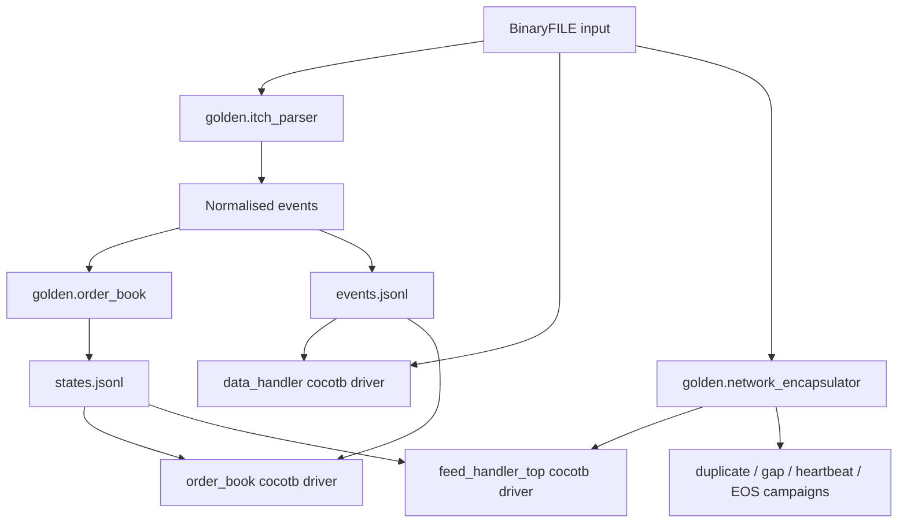

# Golden Model and Verification

The golden model consumes ITCH BinaryFILE input, normalises book-mutating messages into a stable event contract, replays those events through a reference order book, and emits matched JSONL oracle streams for RTL comparison.

It is the functional source of truth for the project. The Python is deliberately clear and explicit rather than optimised to resemble the hardware implementation.

Commands for generating the oracles and running the RTL tests are kept in [`running_the_project.md`](running_the_project.md) so this document remains focused on architecture, contracts, and proof scope.

---

## 1. Verification architecture



The verification stack is layered so that failures can be localised:

```text
Python unit tests
    -> decoder isolation
    -> order-book isolation
    -> router/book integration
    -> network-ingress isolation
    -> complete network-to-book replay
    -> duplicate/gap/control-packet campaigns
    -> implementation timing and resources
```

---

## 2. Source files

| File | Role |
|---|---|
| `golden/contracts.py` | Frozen dataclasses and enums: `NormalisedEvent`, `BookState`, `Bbo`, `Level`, `Op`, and `Side` |
| `golden/itch_parser.py` | BinaryFILE reader, ITCH message decoder, Stock Directory parsing, and symbol-to-locate resolution |
| `golden/order_book.py` | Reference displayed order book |
| `golden/stimulus.py` | Directed and seeded-random synthetic BinaryFILE generator |
| `golden/runner.py` | Parser/book entry point that emits the matched JSONL streams |
| `golden/network_encapsulator.py` | BinaryFILE to MoldUDP64/UDP/IPv4/Ethernet vector generator |
| `golden/tests/` | Parser, book, stimulus, runner, and encapsulator unit tests |
| `tb/itch_harness/` | Cocotb layouts, drivers, oracle loading, AXI helpers, and scoreboards |

---

## 3. Input format

The golden model consumes Nasdaq ITCH **BinaryFILE** records:

```text
2-byte big-endian message length
ITCH payload bytes
2-byte big-endian message length
ITCH payload bytes
...
```

The two-byte length prefix is not part of the ITCH message. `iter_binaryfile_payloads()` strips the prefix and yields:

```python
(msg_index, payload)
```

`msg_index` counts every source record, including ignored messages. That index is retained in the oracle so a scoreboard can report the exact feed position of the first divergence.

Public BinaryFILE samples do not contain Ethernet, IPv4, UDP, or MoldUDP64 headers. The network encapsulator synthesises those layers from the same source payloads used by the parser.

---

## 4. Normalised event contract

The parser maps the supported ITCH messages into one internal Python shape:

```python
@dataclass(frozen=True)
class NormalisedEvent:
    op: Op
    locate: int
    side: Side
    order_ref: int
    msg_index: int
    price: Optional[int] = None
    shares: Optional[int] = None
    new_order_ref: Optional[int] = None
    timestamp_ns: Optional[int] = None
```

| Operation | Required event fields |
|---|---|
| `ADD` | locate, side, order reference, price, shares |
| `EXECUTE` | locate, order reference, executed shares |
| `CANCEL` | locate, order reference, cancelled shares |
| `DELETE` | locate and order reference |
| `REPLACE` | locate, original reference, new reference, new price, new shares |

The assertions in `contracts.py` are part of the oracle contract. They stop malformed parser output from silently entering the reference book.

---

## 5. ITCH messages decoded

| ITCH type | Name | Normalised operation | Book treatment |
|---|---|---|---|
| `A` | Add Order | `ADD` | Insert displayed order |
| `F` | Add Order with MPID | `ADD` | Same as `A`; attribution is ignored |
| `E` | Order Executed | `EXECUTE` | Reduce displayed shares; price comes from the stored order |
| `C` | Order Executed with Price | `EXECUTE` | Same displayed-book mutation as `E`; execution price is not the displayed level |
| `X` | Order Cancel | `CANCEL` | Partially reduce displayed shares |
| `D` | Order Delete | `DELETE` | Remove all remaining displayed shares |
| `U` | Order Replace | `REPLACE` | Delete old reference and add the replacement with inherited side |

Stock Directory messages (`R`) are handled separately to resolve a symbol to its daily locate code. Administrative, trade, auction, and other messages that do not mutate the displayed book are ignored by `parse_itch_message()`.

---

## 6. Symbol and locate filtering

Real ITCH data is multi-symbol, while an individual hardware book covers one routed instrument and a bounded price window. The runner therefore supports:

- direct filtering by a known stock-locate code;
- symbol filtering by first resolving the daily locate from Stock Directory messages.

Symbol and locate filters are mutually exclusive. Unfiltered real input should only be used deliberately, because combining different instruments into one single-instrument oracle would produce an invalid comparison.

The hardware replay flow may rewrite the chosen instrument's daily locate to the routed locate expected by the PL design. The golden and RTL paths must use the same instrument selection.

---

## 7. Reference order-book behaviour

The Python book maintains:

```text
order_table: order_ref -> {side, price, shares, locate}
bid_levels: price -> {aggregate shares, order count}
ask_levels: price -> {aggregate shares, order count}
```

| Operation | Order-table mutation | Price-level mutation |
|---|---|---|
| `ADD` | Insert a new reference | Increase shares and order count |
| `EXECUTE` | Reduce remaining shares; remove at zero | Reduce aggregate shares; decrement count only when the order dies |
| `CANCEL` | Same remaining-share semantics as execute | Same aggregate semantics as execute |
| `DELETE` | Remove the order | Remove all remaining shares and decrement count |
| `REPLACE` | Remove old reference and insert new reference | Validate then apply delete-and-add using the inherited side |

BBO is derived from occupied levels:

```text
best bid = highest occupied bid price
best ask = lowest occupied ask price
```

Empty sides are `None` in Python and `null` in JSON.

---

## 8. Matched oracle files

The default oracle directory contains:

```text
build/golden/itch_synthetic.bin
build/golden/events.jsonl
build/golden/states.jsonl
```

| Output | Meaning | Primary use |
|---|---|---|
| `itch_synthetic.bin` | Length-prefixed BinaryFILE stimulus | Common input for parser and RTL replay |
| `events.jsonl` | One normalised accepted book event per row | Decoder isolation and direct book input |
| `states.jsonl` | Expected post-event book snapshot | Book and full-chain BBO/state comparison |

Row `n` in `events.jsonl` and row `n` in `states.jsonl` refer to the same accepted event and source `msg_index`.

Example event:

```json
{"msg_index":1,"op":"ADD","locate":1,"side":"BUY","order_ref":1001,"price":10000,"shares":100,"new_order_ref":null,"timestamp_ns":100}
```

Example state:

```json
{
  "msg_index": 1,
  "bbo": {"bid_price": 10000, "bid_size": 100, "ask_price": null, "ask_size": null},
  "bid_levels": [{"price": 10000, "shares": 100, "order_count": 1}],
  "ask_levels": []
}
```

Bids are written in descending price order and asks in ascending price order so diffs remain deterministic.

---

## 9. Cocotb verification layers

| Target | Test module | Main checks |
|---|---|---|
| `mold_seq_guard` | `test_mold_seq_guard.py` | First packet, in-order, duplicate, gap, heartbeat, EOS, and sticky stale behaviour |
| `data_handler` | `test_data_handler.py` | Complete BinaryFILE replay against `events.jsonl`, ignored messages, and output backpressure |
| `order_book` | `test_order_book.py` | Lifecycle, aggregation, collisions, replace cases, boundaries, reset, deterministic random streams, and oracle BBO replay |
| `order_book_top` | `test_order_book_top.py` | Symbol routing, base-price forwarding, wrapper behaviour, and replay |
| `ingress_top` | `test_ingress.py` | Exact payload recovery, multiple-message datagrams, backpressure, control packets, and malformed-frame drop |
| `ingress_top_perf_probe` | `test_ingress_perf.py` | Cycle-level ingress latency and throughput instrumentation |
| `feed_handler_top` | `test_feed_handler_top.py` | Complete network-to-book replay, logical A/B duplicates, gaps, late packets, heartbeat, and EOS |

### Current full-chain campaigns

The current campaigns include:

- one and multiple ITCH messages per MoldUDP64 packet;
- different ITCH message lengths and AXI beat alignments;
- messages that straddle input beats;
- downstream backpressure;
- exact packet duplicates;
- one logical B copy after each A copy;
- a missing packet followed by post-gap data and then the late missing packet;
- heartbeat and EOS packets without book mutation;
- heartbeat-driven forward-gap reporting;
- checks that valid streams produce no unexpected frame, MoldUDP64, or realignment errors.

The A/B campaign is a logical duplicate stream presented to one RTL ingress. It proves first-copy acceptance and duplicate suppression, not arbitration between two physical network receivers.

---

## 10. Comparison boundaries

### Decoder isolation

```text
BinaryFILE payloads -> data_handler -> normalised RTL events
                                  == events.jsonl
```

The comparison is operation-aware: fields that are meaningful for the operation must match exactly, while unused packed fields are not treated as semantic data.

### Book isolation

```text
events.jsonl -> packed events -> order_book -> BBO/state
                                           == states.jsonl
```

The primary automated RTL checks currently prove BBO behaviour after accepted events. The Python state stream contains more information than is presently observed from the RTL.

### Complete path

```text
BinaryFILE -> network encapsulator -> Ethernet frames
           -> ingress -> decoder -> router -> book -> BBO
                                              == states.jsonl
```

Starting every layer from the same BinaryFILE source prevents the network and file-fed paths from using different event sequences.

---

## 11. What is proven and what remains

### Proven by the current automated flow

- golden parser and book unit behaviour;
- `A/F/E/C/X/D/U` normalisation;
- decoder replay against the event oracle;
- directed and random valid order-book BBO behaviour;
- Ethernet/IPv4/UDP payload recovery for the supported header shape;
- MoldUDP64 message splitting and variable-length realignment;
- packet-level duplicate suppression and post-gap stale reporting;
- complete synthetic network-to-book BBO replay;
- operation under directed downstream backpressure.

### Not yet fully proven

The primary RTL scoreboards do not yet compare after every event:

- every live order-table entry;
- every bid and ask aggregate level;
- per-level order counts, which are not stored in the current RTL contract;
- tombstone placement and table occupancy as an externally defined contract.

Full internal-state checking should begin through simulator backdoor access so it adds no latency or area to the hardware. A debug readout interface is only justified if simulator access is insufficient or hardware inspection is required.

The final board flow also still needs an automated capture of every BBO update and a board-versus-golden comparison.

---

## 12. Assumptions and limitations

- Prices remain integer ITCH `Price(4)` values throughout the golden and RTL paths.
- The model tracks the displayed order book only.
- Real multi-symbol inputs must be filtered or routed consistently.
- BinaryFILE input does not contain the network layers; those are generated by the encapsulator.
- Python uses `None`/`null` for an empty BBO side. The RTL must use a documented conversion convention while its packed interface has no explicit side-valid bits.
- The oracle defines semantic book state, not internal hash-table slot placement.
- Timing closure and resource utilisation are implementation checks, not substitutes for functional comparison.

See [`running_the_project.md`](running_the_project.md) for all executable commands.
