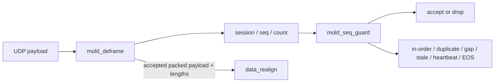

# MoldUDP64 Sequence Handling

This document defines the packet-level sequence policy implemented around `mold_deframe.sv` and `mold_seq_guard.sv`.

The sequence guard protects the downstream ITCH decoder and order book from duplicate packet application, reports gaps, and keeps a sticky stale state. It deliberately does not implement a retransmission or state-recovery channel.

Commands for generating duplicate, A/B, gap, heartbeat, and EOS vectors are in [`running_the_project.md`](running_the_project.md).

---

## 1. MoldUDP64 framing

A MoldUDP64 UDP payload begins with:

```text
session[10 bytes]
sequence_number[8 bytes]
message_count[2 bytes]
```

For a normal data packet, the header is followed by `message_count` blocks:

```text
message_length[2 bytes]
ITCH_message[message_length bytes]
```

The sequence number identifies the first ITCH message in the packet. Subsequent messages increment implicitly, so for a normal packet:

```text
packet_end = sequence_number + message_count
```

`packet_end` becomes the next expected sequence after the packet is accepted.

Special message counts are:

```text
0x0000 -> heartbeat (start)
0xffff -> end of session
```

Both are status-only and contain no ITCH message blocks.

---

## 2. RTL split



`mold_deframe` parses the header and message blocks. `mold_seq_guard` decides whether the current datagram may forward payload and updates the expected sequence state.

The sequence decision is made when one `seq_valid` pulse is presented for the parsed header.

---

## 3. Acceptance policy

| Condition | Packet action | Sequence/status action |
|---|---|---|
| First normal data packet | Accept | Establish `expected_seq = seq + count`; pulse in-order |
| `seq == expected_seq` | Accept | Advance `expected_seq` by `count`; pulse in-order |
| `seq > expected_seq` | Accept | Record the missing range, set sticky stale, and advance past the accepted packet; pulse gap |
| `seq < expected_seq` | Drop | Do not mutate the book; pulse duplicate |
| `count == 0` | Drop payload | Pulse heartbeat; establish or update sequence status as described below |
| `count == 0xffff` | Drop payload | Pulse EOS; establish or update sequence status as described below |

A packet that begins before `expected_seq` is treated as wholly duplicate/late. The current implementation does not partially recover a packet that overlaps the expected sequence range.

---

## 4. Gap and stale behaviour

When a packet starts after the expected sequence:

```text
gap_start = expected_seq
gap_end   = received_seq - 1
```

The post-gap packet is still accepted. This is a deliberate low-latency decision: the hot path continues processing available data instead of blocking while waiting for recovery.

The consequence is that the book is no longer guaranteed to represent complete exchange state. `stale` therefore becomes sticky.

`mold_seq_guard` contains an optional `clear_stale_i` control, but it is currently tied low

Clearing stale status alone would not reconstruct any missed orders, so a production implementation would still need retransmission or snapshot recovery before the book could be considered current again.

---

## 5. Duplicate suppression and logical A/B behaviour

Nasdaq-style A/B feeds carry redundant copies of the same sequenced data. The implemented packet-level rule is first-copy-wins:

```text
first copy at the expected sequence -> accepted
later copy beginning below expected -> dropped as duplicate/late
```

The current verification campaign generates logical A and B copies and presents them to the same RTL input. This proves that a second copy cannot update the book twice.

---

## 6. Heartbeat handling

A heartbeat has `count == 0` and no ITCH payload.

Behaviour:

- the payload path is dropped;
- `heartbeat` pulses for one cycle;
- a first heartbeat establishes the expected sequence at its advertised `seq`;
- a heartbeat equal to the current expectation confirms liveness without changing it;
- a heartbeat ahead of the current expectation reports a gap, sets stale, records the missing range, and moves `expected_seq` to the heartbeat sequence.

Because a heartbeat contains no messages, it never mutates the order book.

---

## 7. End-of-session handling

An end-of-session packet has `count == 0xffff` and no ITCH payload.

Behaviour:

- the payload path is dropped;
- `eos` pulses for one cycle;
- the sequence/status comparison follows the same control-packet rules as heartbeat;
- no order-book event is emitted.

The current sequence guard reports EOS but does not itself clear or invalidate order-book memory. Session-reset policy remains a higher-level control decision.

---
