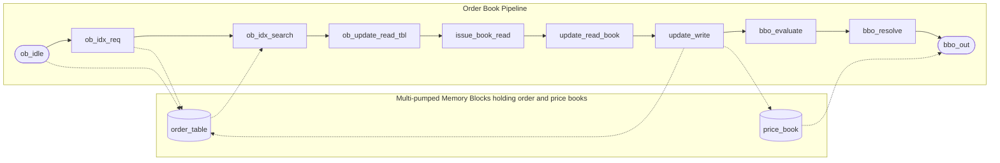

# Pipelined Order Book

> Note that information for the top module, and symbol router also part of the entire order book system can be found in the [v2 varient](/docs/order_book.md) of the order book. The information about the v2 rder book may also provide good context for the changes made here. However, this document should provide a comprehensive description of what occurs in this block

The Pipelined Order Book is an updated version of the v2 order book. It is now a 10-stage pipeline which takes in data from the data handler, updates the order book and bid/ask price books, and outputs the BBO outputs.

---

## Format

The design of this module can be explained through this diagram below:

---

## Logic

Each block has a specific function which is similar to that of the v2 order book states. They will be referred to here, but a full description of the block will be given otherwise.

### ob_idle

The ob_idle block acts similar to the `IDLE` state. In this block
