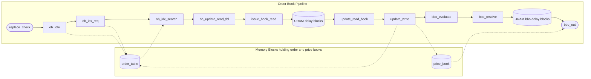

# Pipelined Order Book

> Note that information for the top module, and symbol router also part of the entire order book system can be found in the [v2 varient](/docs/order_book.md) of the order book. The information about the v2 order book may also provide good context for the changes made here. However, this document should provide a comprehensive description of what occurs in this block

> Note that this has now been updated for the v4 release of the order book, see the relevant branches to look at previous versions of this block

The Pipelined Order Book is an updated version of the v2 and v3 order books. It is now a 16-stage pipeline which takes in data from an async FIFO which bridges the 156.25 MHz netowrking domain,and the 250 MHz order book domain. The order book then updates the order book and bid/ask price books, and outputs the BBO outputs.

---

## Format

The design of this module can be explained through this diagram below:

---

## Logic

Each block has a specific function which is similar to that of the v2 order book states. They will be referred to here, but a full description of the block will be given otherwise.

### ob_replace_check

This block is new (and unlike any other block we had originally) which has a similar impact to the `REPLACE_ADD` state. Essentially this block detects whether there has been a replace instruction given. If so, we will de-assert our ready_o signal, and pass a delete instruction followed by an add instruction with signals indicating that these instructions came from a given replace instruction. Given the complexities of a replace instruction, this was deemed an optimal solution

### ob_idle

The ob_idle block acts similar to the `IDLE` state. In this block, we hash the order reference number (ORN) using XOR hashing, and latch relevant data for the next stages

### ob_idx_req

This blocks acts similar to the `IDX_REQ` state. In this block, we search the Content Addressable Memory (CAM) determining both if there is an avaiilable free spot, or the specific entry we are looking for is present in the CAM (this handles entry search for all instruction types we allow through this system). As well as passing data through the required state, we also determine our delta value (i.e. the difference in price between the incoming entry price and the base price of the stock we are looking at defined in the PS).

### ob_idx_search

This block acts similar to the `IDX_SEARCH` state. In this block we look at three entires in our order table (given that we ae using 3-way associative hashing) and determine whether we have a free slot (for an add instruction), or have found the correct entry relative to its ORN (for a delete/reduce instruction).

> Note that in the case where we cannot find an entry to slot data into, the system will drop this order entry. Although in testing, this case does not happen, it must be noted that it would happen in this case

> In a similar vein, in the case where the entry specified by ORN cannot be found in CAM or in hash table, the entry will be invalidated, and all changes as an occurence of that entry will be voided. This is actually better for error handling with incorrect signals (i.e. a delete instruction before a valid input has been sent), but given the first problem, this would be the next consequence of this.

### ob_update_read_tbl

This block acts similar to the `UPDATE_READ_TBL` state. In this block, we are mainly using this as a cycle delay for the read of data from the order table, it also handles potential CAM reads asynchronously (given CAM is synthesised as LUTRAM)

### ob_issue_book_read

This blocks acts similarly to the `ISSUE_BOOK_READ` state. In this block, we are preparing the data signals that are going to be used to read values in the price books (i.e. their delta price values and shares value) by writing in values for the address ports to read data

### ob_update_read_book

This block acts similarly to the `UPDATE_READ_BOOK` state. In this state, we determine whether we are looking at data from the bid book or the ask book. Depending on this determines what data we read from the price book (where the read was initiated in the previous block). This block also includes some calculations required for the next block

### ob_update_write

This block acts as the `UPDATE_WRITE` state. This block has to determine and do much of our complex logic that has been built up from other blocks, as well as preparation for BBO outputs. This includes:

- Level depletion (i.e. if we are completely removing an entry via a reduce instruction)
- Same level replacement (i.e. if we are replacing an instruction but using the same hashing index in the updated instruction)
- Writing of data into all books (order and price books) and/or CAM

### ob_evaluate_bbo

This block is an accumulation of both the `EVALUATE_BBO` and `BBO_SEARCH_REQ` states. The block first determines whether a new bbo output is required (i.e. in the case where have added a new best bid/ask price value, or removed the current best value). If we do need a new one, then we will search the relevant price book which is split into 64 chunks. Using a priority encoder, we determine the most significant chunk and store this chunk for the next state.

### ob_bbo_resolve

This block is similar to `BBO_SEARCH_EVAL` where we concatenate the most significant chunk with the most significant bit of that chunk determining the most significant new (delta) price. We also pass this entry (delta value) into our price book to read the number of shares at that price point.

### ob_bbo_out

This block is a combination of the `FETCH_BBO`, `FETCH_BBO_WAIT` and `EMIT` states. Given the read of the relevant price entry occurs in the previous cycle, we form out `bbo_t` strcut with the relevant bid/ask price and shares values (determining price by adding the latched base price to the delta value to obtain the original price).

### URAM Delay Blocks

These blocks are used as pipelined stages due to the price books being synthesised as URAM in our new system. These extra states are also helpful for some read conditions with the order table explained in the next chapter, but thet are mostly used for the URAM delays required at high frequencies.

## Memory Management of order and price books

The L3-in order book (unfortunately named `order_table`) has been synthesised using BRAM acting as simple dual port (SDP) RAM. The order table is also a 3-way associative RAM block, meaning it stores 3 order entries (and relevant data) per address. Given a depth of 2^10 (1024), this gives a total space for entries being equal to 3072 per stock (this may seem low initially, but it must be noted that deleted entries/ replaced entries can also be removed, hence a larger space is not required).

Given each entry stores 131 bits as defined by the struct below, the entire order table holds **402,432 bits**. This means that each order table synthesises into 12 BRAM blocks.

The bid and ask price books have been synthesised using URAM also acting as SDP RAM. These books have a depth of 2^14 (16,384) due to their price windoow and each entry stores 32 bits of data. This means each price book holds **524,288 bits**. This means that each price book synthesises into 4 URAM blocks (due to using SDP RAM, single-port would give 2 URAM blocks per book).

> Note that the choice for price books being in URAM stems from the posibility of extending our price window depth, also given that BRAM was our limiting factor, we decided that URAM price books may be more optimal
