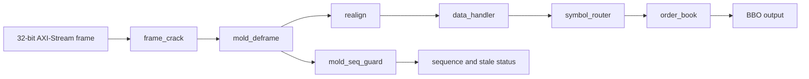

# RTL Datapath

This document describes the stage boundaries and control decisions in the Programmable Logic datapath. Detailed order-book internals remain in [`order_book.md`](order_book.md), and detailed network parsing is in [`networking_ingress.md`](networking_ingress.md).

---

## 1. Pipeline overview



The stages use ready/valid handshakes so downstream backpressure propagates without dropping or duplicating data. A transfer occurs only when both `valid` and `ready` are asserted.

The implemented PYNQ path receives frames from an MM2S AXI DMA. A networking board with a PL-facing MAC/CMAC can drive the same ingress contract directly.

---

## 2. Shared stream conventions

The current ingress width is:

```text
AXIS_DATA_W = 32 bits
AXIS_KEEP_W = 4 bits
```

Bytes are carried in network order, with the earliest byte in the most-significant active lane. Final-beat `tkeep` must be contiguous from the first lane.

Each packet boundary uses `tlast`:

- one complete Ethernet frame enters `frame_crack` per AXI packet;
- one complete UDP/MoldUDP64 datagram crosses the frame-cracker boundary;
- `realign` emits one complete ITCH message per AXI packet.

The exact packed event and BBO definitions live in `rtl/hdl_header.sv`; documentation should describe their semantics rather than duplicate bit offsets that can drift from the package.

---

## 3. Stage summary

| Stage | Input | Output | Main state held |
|---|---|---|---|
| `frame_crack` | Ethernet frame AXI stream | UDP payload AXI stream + datagram length/start | Fixed-header fields, payload carry, frame error state |
| `mold_deframe` | UDP payload / MoldUDP64 datagram | Message payload byte stream + one length token per ITCH message | Header byte index, message count, current message length/remaining bytes |
| `mold_seq_guard` | Parsed sequence and count | Accept/drop decision and sequence status | Expected sequence, sticky stale, latched gap range |
| `realign` | Concatenated payload bytes + length tokens | One aligned ITCH AXI packet per message | Current message length and partial output bytes |
| `data_handler` | Aligned ITCH message | Normalised event | Message capture and decode FSM |
| `symbol_router` | Normalised event + configured base price | Selected book event | Registered event/routing boundary |
| `order_book` | Selected normalised event | BBO data + valid pulse | Order table, bid/ask levels, occupancy maps, update FSM |

---

## 4. `frame_crack`

`frame_crack` validates the supported Ethernet II / IPv4 / UDP header shape and emits only the UDP payload.

Current assumptions:

- untagged Ethernet II;
- EtherType `0x0800`;
- IPv4 with IHL = 5;
- UDP protocol;
- no IPv4 fragments;
- optional destination-port checking;
- IP and UDP checksums are not validated;
- Ethernet FCS is assumed to be handled before the RTL boundary.

The supported fixed prefix is 42 bytes. On a 32-bit bus, eleven input beats are required before the first payload bytes can be forwarded. The design therefore uses a fixed carry aligner instead of a general-purpose variable-header parser.

This choice minimises combinational selection logic for the current supported packet shape. VLAN tags, IPv4 options, and fragments are rejected rather than adding latency and control complexity to the hot path.

---

## 5. `mold_deframe` and `mold_seq_guard`

`mold_deframe` consumes the 20-byte MoldUDP64 header:

```text
session[10] + sequence[8] + message_count[2]
```

It then extracts each message block:

```text
message_length[2] + ITCH payload
```

The stage produces two coordinated outputs:

1. a concatenated payload byte stream;
2. one length token for each message.

The downstream contract is strict: every accepted length token must correspond to exactly that many payload bytes.

The sequence guard decides whether the parsed datagram is accepted. Its duplicate, gap, stale, heartbeat, and EOS rules are documented in [`moldudp64_sequence_handling.md`](moldudp64_sequence_handling.md).

The current implementation processes a captured input beat one byte at a time. This simplifies state control but reduces sustained throughput to about four payload bytes per six cycles. The intended optimisation is beat-parallel parsing without changing the external stage contract.

---

## 6. `realign`

MoldUDP64 message blocks have variable lengths and arbitrary offsets relative to the 32-bit stream. A message may span several beats, and the end of one message may share a beat with the beginning of the next.

`realign` uses the message-length stream to emit:

```text
one aligned AXI packet per complete ITCH message
```

It is responsible for:

- message boundaries that do not align to input beats;
- messages spanning multiple beats;
- partial final output beats;
- correct `tkeep` and `tlast` generation;
- backpressure without consuming uncommitted bytes;
- zero-length, underflow, overflow, and malformed-`tkeep` errors.

The current byte-serial architecture repeats unpack/repack work already performed in `mold_deframe`. A small register/LUT reservoir is the preferred optimisation because it can accept and emit a 32-bit beat in the same cycle without consuming additional BRAM.

---

## 7. `data_handler`

`data_handler` consumes one aligned ITCH message and emits one normalised event for the supported displayed-book operations:

```text
A, F, E, C, X, D, U
```

Unsupported messages are consumed without asserting event valid. The completed event remains stable while the downstream path applies backpressure.

The decoder is message-serial: it captures one complete ITCH message, extracts fixed-offset fields, and enters a send state until the event is accepted. Normal latency therefore scales mainly with message length rather than arithmetic depth.

Detailed field extraction is documented in [`data_handler.md`](data_handler.md).

---

## 8. `symbol_router`

The router sits between the generic decoded event and the hardware book instance.

Its responsibilities are:

- compare the event's stock locate against the configured/routed instrument;
- drop non-target events without unnecessarily applying book backpressure;
- forward the selected event and corresponding base price;
- provide a registered timing boundary between decoder and book.

The one-cycle register is a deliberate latency/timing trade-off. It adds 9.375 ns at the current clock, but prevents a longer combinational decoder-to-book path and gives the book a stable event boundary.

---

## 9. `order_book` boundary

The book receives a normalised event after symbol selection. It resolves order references, updates separate bid and ask aggregate memories, maintains active-level maps, and emits a BBO-valid pulse after each completed event.

The current book is serial and non-overlapped. Synchronous memory reads and writes are represented as explicit FSM states. This provides deterministic ordering and avoids overlapping read-modify-write hazards on the same order reference or price level.

The cost is an initiation interval of roughly ten cycles in the common case. A future overlapped design must add same-reference and same-level forwarding or stalls; simply accepting another event early would make consecutive updates observe stale memory.

Detailed implementation belongs in [`order_book.md`](order_book.md).

---

## 10. Backpressure and buffering

Every stream stage must obey the standard rules:

- data and sideband remain stable while `valid` is high and `ready` is low;
- state advances only on a completed handshake;
- `tlast` and `tkeep` remain associated with the held data beat;
- upstream readiness must not form a combinational loop through the complete chain.

One-beat skid buffers are suitable at major boundaries when timing or elasticity requires them. They can add one cycle to an isolated first beat, but allow registered `ready`, simultaneous upstream/downstream handshakes, and fewer throughput bubbles.

They should be added based on timing and backpressure measurements, not inserted speculatively at every boundary.

---

## 11. Latency decisions

At the current 106.667 MHz routed clock:

- `frame_crack` is constrained mainly by receiving the fixed 42-byte header;
- `mold_deframe` and `realign` lose throughput through byte-serial processing;
- the decoder is message-serial;
- the router intentionally adds one register cycle;
- the order book is a serial BRAM-backed update engine.

The optimisation priority is therefore:

```text
instrument -> parallelise deframe -> reservoir realign -> remeasure
    -> add skid buffers where justified -> optimise decoder/book only after bottleneck moves
```

Widening the AXI bus before removing byte-serial processing would increase interface width without increasing accepted bytes per cycle inside the bottleneck stages.

---

## 12. Verification boundaries

Each stage has a stable isolation point:

| Boundary | Primary proof |
|---|---|
| Ethernet frame to UDP payload | Exact payload recovery and frame-drop/error tests |
| MoldUDP64 datagram to payload/length streams | Message count, lengths, control packets, malformed length handling |
| Payload/length streams to aligned ITCH packets | Byte-exact recovery across offsets, straddles, and backpressure |
| ITCH packet to normalised event | Comparison against `events.jsonl` |
| Normalised event to BBO | Comparison against `states.jsonl` |
| Complete frame-to-BBO chain | Same BinaryFILE source through encapsulator and golden model |

The complete verification architecture is in [`golden_model.md`](golden_model.md).
